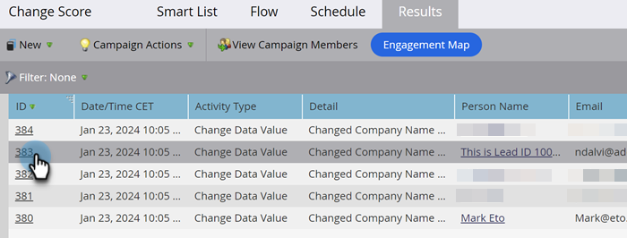

# Exibir resultados do Smart Campaign {#view-smart-campaign-results}

Deseja ver um detalhamento de tudo o que aconteceu em uma Campanha inteligente? Veja como.

>[!TIP]
>
>Você pode ver a lista de pessoas que foram processadas pelo Smart Campaign clicando em [Exibir Membros do Campaign](/help/marketo/product-docs/core-marketo-concepts/smart-campaigns/smart-campaign-data/view-smart-campaign-members.md){target="_blank"}.

1. Em sua Campanha inteligente, clique em **[!UICONTROL Resultados]**.

   

   >[!TIP]
   >
   >Você também pode filtrar os resultados com base no tipo de atividade. Saiba como [filtrar resultados da Campanha Inteligente](/help/marketo/product-docs/core-marketo-concepts/smart-campaigns/smart-campaign-data/filter-smart-campaign-results.md){target="_blank"}.

1. Clique em uma **[!UICONTROL ID]** para exibir mais detalhes sobre essa atividade específica.

   

   >[!TIP]
   >
   >Exibir detalhes da pessoa clicando no nome dela.

   Acesse os resultados para ver o que sua campanha realmente fez, ou simplesmente [exporte os resultados do Smart Campaign para o Excel](/help/marketo/product-docs/core-marketo-concepts/smart-campaigns/smart-campaign-data/export-smart-campaign-results-to-excel.md){target="_blank"}.

   >[!MORELIKETHIS]
   >
   >[Filtrar resultados da campanha inteligente](/help/marketo/product-docs/core-marketo-concepts/smart-campaigns/smart-campaign-data/filter-smart-campaign-results.md){target="_blank"}
