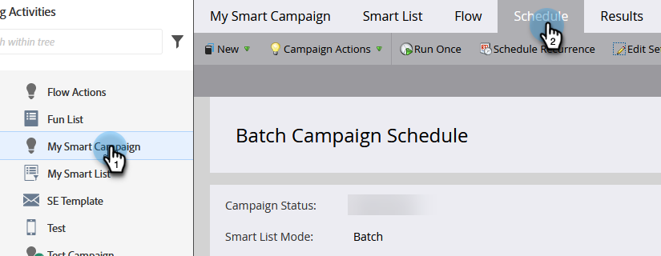

# Sobre campanhas inteligentes {#abort-a-smart-campaign}

>[!CAUTION]
>
>Apenas para uso de emergência

Às vezes, você inicia uma Campanha Inteligente e percebe imediatamente que foi um erro. Aqui está como puxar o freio de emergência e parar a Campanha Inteligente no meio do percurso.

1. Escolha a Campanha inteligente desejada e clique na guia **[!UICONTROL Agendar]**.

   

1. Clique no menu suspenso **[!UICONTROL Ações de campanha]**. Selecione **[!UICONTROL Cancelar Campanha]**.

   

1. Clique em **[!UICONTROL Abortar]** para confirmar.

   

   >[!NOTE]
   >
   >A anulação não desfaz etapas já concluídas, apenas impede que mais etapas ocorram (por exemplo: os emails não podem ser entregues de forma cancelada).

   

   >[!NOTE]
   >
   >Consulte a guia **[!UICONTROL Resultados]** da Campanha Inteligente para ver quais ações ocorreram antes da anulação. Você também encontrará uma [notificação](/help/marketo/product-docs/core-marketo-concepts/miscellaneous/understanding-notifications.md){target="_blank"} com detalhes adicionais.

   >[!TIP]
   >
   >Deseja remover uma pessoa do fluxo em uma campanha de acionador? Confira [Remover do Fluxo](/help/marketo/product-docs/core-marketo-concepts/smart-campaigns/flow-actions/remove-from-flow.md){target="_blank"}.

Sempre verifique o seu trabalho, mas este freio de emergência pode ser útil.
