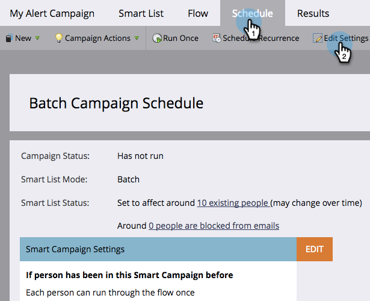

# Aplicar limites de comunicação à campanha inteligente {#apply-communication-limits-to-smart-campaign}

>[!PREREQUISITES]
>
>[Ativar limites de comunicação](/help/marketo/product-docs/administration/email-setup/enable-communication-limits.md){target="_blank"}

Não é uma boa ideia enviar email para alguém várias vezes ao dia, ou muitas vezes em uma semana, certo? Felizmente, o Marketo Engage tem limites de comunicação para ajudar.

>[!NOTE]
>
>Quando qualquer pessoa excede os limites definidos de comunicação, o Marketo bloqueia emails não operacionais (emails operacionais sempre são enviados).

1. Na Campanha inteligente, clique na guia **[!UICONTROL Agendar]** e depois **[!UICONTROL Editar configurações]**.

   

1. Verifique a **[!UICONTROL Bloquear emails não operacionais]** e clique em **[!UICONTROL Salvar]**.

   

>[!NOTE]
>
>Limite refere-se ao número de pessoas qualificadas que uma Campanha inteligente pode afetar.

>[!TIP]
>
>Para tornar isso o padrão, edite o [limites de comunicação](/help/marketo/product-docs/administration/email-setup/enable-communication-limits.md){target="_blank"} na seção Admin.

Agora você pode ter certeza de que não está enviando muitos emails acidentalmente para seu público-alvo.
