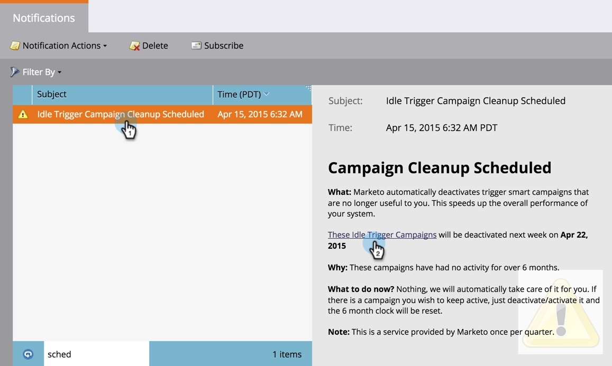

# Limpeza automática da Campanha do acionador {#automatic-trigger-campaign-cleanup}

O Marketo tem um serviço legal/gratuito para desativar campanhas inteligentes acionadas que não têm mais atividade. Isso acelera o desempenho geral do sistema e economiza tempo.

## O que acontece? {#what-happens}

Uma vez por trimestre, o Marketo encontrará campanhas inteligentes que ficam dormentes (sem pessoas) por 6 meses ou mais e as desativará.

## Você vai me notificar primeiro? {#will-you-notify-me-first}

Claro! Uma vez por trimestre, você receberá uma notificação uma semana antes mostrando cada campanha que planejamos desativar.

1. Vá para a guia **Notificações**.

   

1. Clique em **Limpeza de Campanha do Acionador Inativo Agendada**. Em seguida, clique no link **Essas Campanhas de acionador ocioso serão desativadas**.

   

   Você verá uma lista de campanhas inteligentes programadas para serem desativadas.

   

## Quais campanhas serão desativadas? {#which-campaigns-will-be-deactivated}

Só desativaremos campanhas de disparo que estejam ativas há mais de 6 meses, mas que tenham 0 pessoas qualificadas nesse período de tempo.

## Espere! Não esta campanha! {#wait-not-this-campaign}

Não se preocupe - o relógio em qualquer campanha inteligente pode ser redefinido por:

* Uma pessoa se qualificando para a campanha.
* Desativação e reativação manual da campanha.

Qualquer um dos dois redefinirá o contador de 6 meses.

## Você vai me dizer quais campanhas foram desativadas? {#will-you-let-me-know-which-campaigns-were-deactivated}

Absolutamente - uma semana após a notificação original, desativaremos as campanhas listadas (menos qualquer que tenha qualificado pelo menos uma pessoa ou tenha sido desativado/reativado) e publicaremos uma notificação de confirmação.

1. Selecione a notificação **Limpeza de Campanha do Acionador Inativo Agendada**. Clique no link **Essas Campanhas de acionador ocioso**.

   

1. Você verá uma lista de campanhas desativadas.

   
