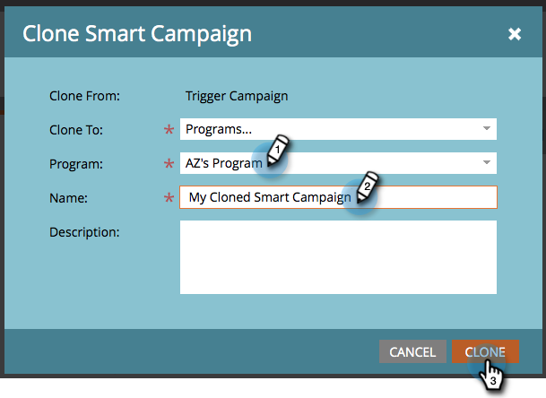

# Ações da campanha: clonar uma campanha inteligente {#campaign-actions-clone-a-smart-campaign}

A clonagem de campanhas pode economizar seu tempo. Não é necessário criar tudo do zero - a clonagem cria uma campanha idêntica com os mesmos filtros de lista inteligente e etapas de fluxo.

1. Selecione a campanha que deseja clonar. No menu suspenso **[!UICONTROL Ações de Campanha]**, selecione **[!UICONTROL Clonar]**.

   

1. Escolha a opção **[!UICONTROL Clonar para]** apropriada. Neste exemplo, vamos escolher **[!UICONTROL Programas]**.

   

1. Escolha um **[!UICONTROL Programa]**. Insira um **[!UICONTROL Nome da campanha]** e clique em **[!UICONTROL Clonar]**.

   

E pronto!
