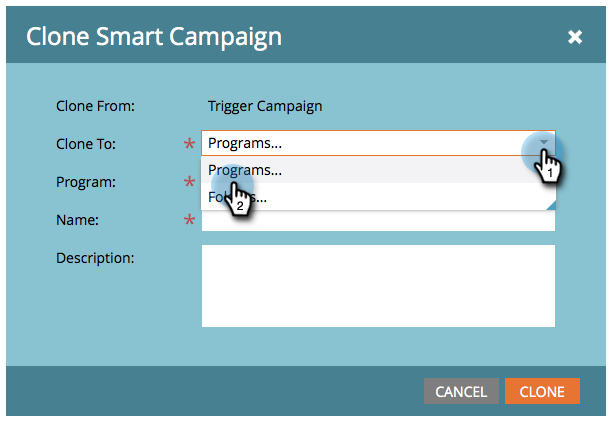

# Ações da campanha: clonar uma campanha inteligente {#campaign-actions-clone-a-smart-campaign}

A clonagem de campanhas pode economizar seu tempo. Não é necessário criar tudo do zero - a clonagem cria uma campanha idêntica com os mesmos filtros de lista inteligente e etapas de fluxo.

1. Selecione a campanha que deseja clonar. No **Ações da campanha** selecione **Clonar**.

   

1. Escolha o **Clonar para** opção. Neste exemplo, vamos escolher **Programas**.

   

1. Escolha um **Programa**. Insira um **Nome da campanha** e clique em **Clonar**.

   

E pronto!
