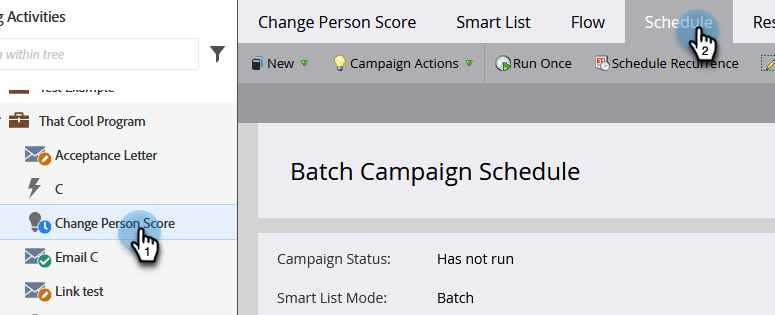

# Cancelar uma execução de campanha em lote agendada {#cancel-a-scheduled-batch-campaign-run}

Se você tiver programado uma execução para uma de suas campanhas em lote e quiser cancelá-la, veja como.

1. Selecione a campanha e vá para a guia **[!UICONTROL Agendamento]**.

   

1. Localize a execução agendada que você deseja cancelar e clique em **x** ao lado dela.

   

1. Confirme o cancelamento clicando em **[!UICONTROL OK]**.

   

>[!NOTE]
>
>Fazer isso não ajudará se a execução já tiver sido iniciada. Use essa opção quando decidir que uma execução futura precisa ser cancelada.
