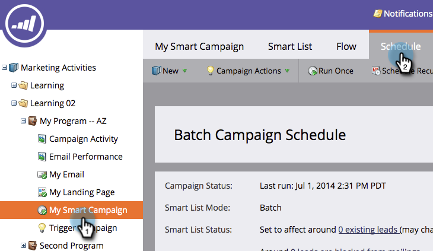

# Cancelar uma Execução Agendada de Campanha de Lote Recorrente {#cancel-a-scheduled-recurring-batch-campaign-run}

Se você tiver uma campanha em lote recorrente que não deseja mais, poderá cancelar as execuções futuras. Veja como.

1. Clique na campanha inteligente e na guia **Agendamento**.

   

1. Clique em **Agendar recorrência**.

   

   >[!TIP]
   >
   >Você pode cancelar uma única execução clicando em  ao lado dela. Saiba como [cancelar uma execução de campanha em lote agendada](/help/marketo/product-docs/core-marketo-concepts/smart-campaigns/using-smart-campaigns/cancel-a-scheduled-batch-campaign-run.md).

1. Defina Agendamento como **Nenhum** e **Salvar**.

   

   Voila! Sua campanha inteligente não funcionará mais.

   >[!CAUTION]
   >
   >Isso cancela execuções futuras, mas se uma campanha inteligente estiver em execução, você não poderá cancelá-la.

   >[!MORELIKETHIS]
   >
   >[Cancelar uma execução de Campanha em lote agendada](/help/marketo/product-docs/core-marketo-concepts/smart-campaigns/using-smart-campaigns/cancel-a-scheduled-batch-campaign-run.md)
