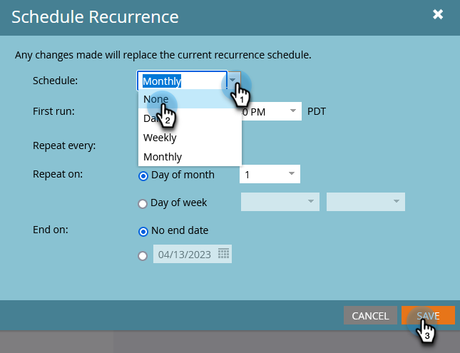

# Cancelar uma execução de campanha em lote recorrente programada {#cancel-a-scheduled-recurring-batch-campaign-run}

Se você tiver uma Campanha em lote recorrente que não deseja mais, cancele as execuções futuras.

1. Selecione a Campanha inteligente e clique na guia **Agendar**.

   

1. Clique em **[!UICONTROL Agendar Recorrência]**.

   

   >[!TIP]
   >
   >Você pode cancelar uma única execução clicando no  vermelho ao lado dele. Saiba como [cancelar uma execução de campanha em lote agendada](/help/marketo/product-docs/core-marketo-concepts/smart-campaigns/using-smart-campaigns/cancel-a-scheduled-batch-campaign-run.md){target="_blank"}.

1. Defina a Agenda como **[!UICONTROL Nenhuma]** e clique em **[!UICONTROL Salvar]**.

   

   Voila! Sua Campanha inteligente não será mais executada.

   >[!CAUTION]
   >
   >Isso cancela as execuções futuras, mas se uma Campanha inteligente estiver em execução, você não poderá cancelá-la.

   >[!MORELIKETHIS]
   >
   >[Cancelar uma execução de campanha em lote agendada](/help/marketo/product-docs/core-marketo-concepts/smart-campaigns/using-smart-campaigns/cancel-a-scheduled-batch-campaign-run.md){target="_blank"}
