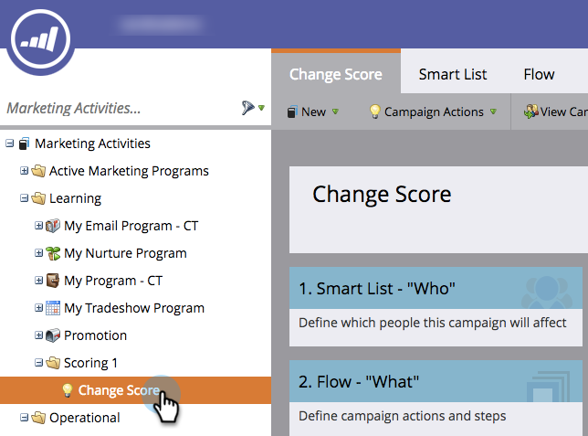

# Desativar uma Campanha inteligente do acionador | Guia Agendamento {#deactivate-a-trigger-smart-campaign-schedule-tab}

Se você tiver uma campanha de disparo antiga que precisa ser desativada, siga estas etapas:

1. Localize e selecione sua campanha de acionador ativa.

   

1. Na guia Agendamento, clique em Desativar.

   

1. Confirme clicando em Desativar.

   

>[!NOTE]
>
>Isso impedirá que *novas* pessoas entrem no fluxo, mas as pessoas em etapas de espera ou qualquer outra etapa do fluxo continuarão se movendo pelo fluxo até que concluído.

