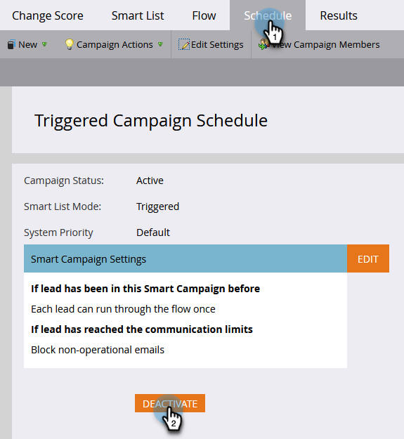

# Desativar uma campanha inteligente de acionador | Guia Programação {#deactivate-a-trigger-smart-campaign-schedule-tab}

Se você tiver uma campanha de acionador antiga que precisa desativar, siga estas etapas:

1. Localize e selecione a campanha ativa do acionador.

   

1. Na guia Agendamento , clique em **Desativar**.

   

1. Confirme clicando em **Desativar**.

   

>[!NOTE]
>
>Isto irá parar *novo* as pessoas não entram no fluxo, mas as pessoas em etapas de espera ou qualquer outra etapa do fluxo continuarão a percorrer o fluxo até que seja concluído.
