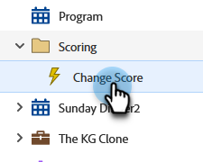

# Desativar um acionador da campanha inteligente Guia Programação {#deactivate-a-trigger-smart-campaign-schedule-tab}

Se você tiver uma campanha de acionador antiga que precisa desativar, siga estas etapas:

1. Localize e selecione sua campanha de acionador ativa.

   

1. Na guia Agendamento, clique em **Desativar**.

   

1. Confirme clicando em **Desativar**.

   

>[!NOTE]
>
>Isso vai parar *novo* as pessoas entram no fluxo, mas as pessoas em etapas de espera ou em qualquer outra etapa do fluxo continuarão a se mover pelo fluxo até que sejam concluídas.
