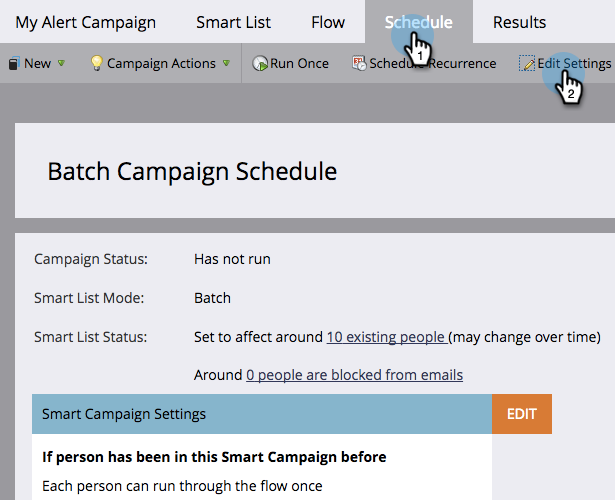

# Editar regras de qualificação em uma campanha inteligente {#edit-qualification-rules-in-a-smart-campaign}

As regras de qualificação controlam quantas vezes alguém pode passar pelo fluxo em uma Campanha inteligente. Por padrão, mesmo que alguém acione uma Campanha inteligente várias vezes, ele só será enviado pelo fluxo uma vez. Veja como modificar essas configurações.

1. Na Campanha inteligente, clique na guia **[!UICONTROL Agendar]** e depois em **[!UICONTROL Editar configurações]**.

   

   >[!TIP]
   >
   >Você também pode clicar em **[!UICONTROL Editar]** à direita de &quot;Configurações do Smart Campaign&quot;.

1. Escolha a frequência com que seus funcionários deverão passar pelo fluxo do Smart Campaign: **[!UICONTROL apenas uma vez]**, **[!UICONTROL todas as vezes]** ou **uma vez a cada # dias**/**semanas**/**meses**.

   

   >[!NOTE]
   >
   >Quando você define uma regra para uma vez por dia todos os dias, o Marketo converte isso em horas. Por exemplo, se você definir a regra para uma vez por dia e uma pessoa se qualificar às 22h em um domingo à noite, ela não poderá se qualificar novamente até às 22h de segunda-feira à noite. Essa lógica também se aplica ao usar semanas ou meses. Um mês é sempre contado como 30 dias.

   >[!NOTE]
   >
   >Os limites de comunicação não são aplicados a Campanhas inteligentes por padrão. Saiba como [aplicar limites de comunicação a uma campanha inteligente](/help/marketo/product-docs/core-marketo-concepts/smart-campaigns/using-smart-campaigns/apply-communication-limits-to-smart-campaign.md){target="_blank"}.

   >[!NOTE]
   >
   >[Aplicar limites de comunicação a campanhas inteligentes](/help/marketo/product-docs/core-marketo-concepts/smart-campaigns/using-smart-campaigns/apply-communication-limits-to-smart-campaign.md){target="_blank"}

Missão cumprida! Agora você sabe como controlar regras de qualificação em uma Campanha inteligente.
