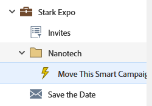

# Mover uma campanha inteligente {#move-a-smart-campaign}

Mova uma Campanha inteligente entre diferentes programas ou pastas usando o recurso de arrastar e soltar ou o recurso de mover na árvore. As regras da Campanha inteligente não serão alteradas, ela apenas será aninhada em um local diferente.

>[!CAUTION]
>
>Como as regras não serão alteradas, se a Smart List ou as Etapas de fluxo da campanha fizerem referência ao programa original, será necessário atualizar manualmente essas informações para refletir o novo programa, pois elas _não_ serão atualizadas automaticamente.

1. Acesse **[!UICONTROL Atividades de marketing]**.

   

1. Localize a Campanha inteligente que deseja mover, clique com o botão direito do mouse nela e selecione **[!UICONTROL Mover]**.

   

1. Selecione o **[!UICONTROL Para]** (destino), **[!UICONTROL Programa]** e a **[!UICONTROL Pasta]** opcional. Selecione **[!UICONTROL Mover]**.

   

   >[!NOTE]
   >
   >Neste exemplo, a Campanha inteligente está sendo movida para outro programa, mas você também pode movê-la para uma pasta de campanha.

A Campanha inteligente foi movida.

