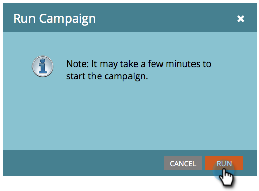

# Executar uma campanha inteligente em lote agora | Guia Programação {#run-a-batch-smart-campaign-now-schedule-tab}

Quando terminar de criar a Campanha em lote, você pode optar por executá-la agora ou posteriormente. Veja como executá-lo imediatamente.

1. Selecione a Campanha em lote, vá para a guia **[!UICONTROL Agendar]** e clique em **[!UICONTROL Executar uma vez]**.

   

1. Verifique se **[!UICONTROL Executar Agora]** está selecionado e clique em **[!UICONTROL Executar]**.

   

1. Confirme clicando em **[!UICONTROL Executar]** mais uma vez.

   

   Fácil! Você também pode [agendar execuções para mais tarde](/help/marketo/product-docs/core-marketo-concepts/smart-campaigns/using-smart-campaigns/schedule-a-batch-smart-campaign-to-run-later.md){target="_blank"}, se preferir.

   >[!NOTE]
   >
   >* [Agendar uma Campanha Inteligente em Lote para Execução Posterior](/help/marketo/product-docs/core-marketo-concepts/smart-campaigns/using-smart-campaigns/schedule-a-batch-smart-campaign-to-run-later.md){target="_blank"}
   >* [Agendar uma Campanha em Lote Recorrente](/help/marketo/product-docs/core-marketo-concepts/smart-campaigns/using-smart-campaigns/schedule-a-recurring-batch-campaign.md){target="_blank"}
