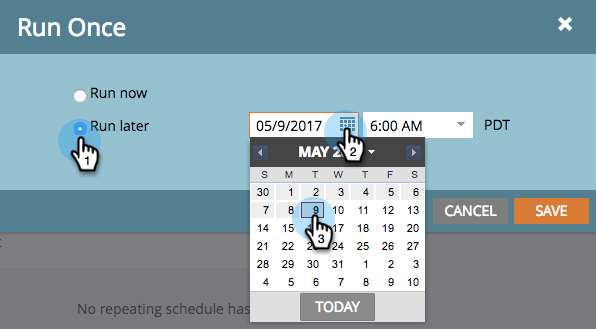
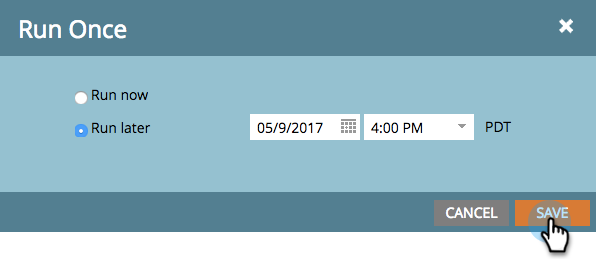

# Agende uma Campanha inteligente em lote para ser executada mais tarde {#schedule-a-batch-smart-campaign-to-run-later}

Se você quiser definir uma campanha inteligente em lote para ser executada em algum momento no futuro, veja como.

>[!TIP]
>
>Você também pode [reprogramar uma campanha inteligente em lote na visualização do cronograma do programa](../../../../product-docs/core-marketo-concepts/programs/program-schedule-view/reschedule-a-batch-smart-campaign-in-the-program-schedule-view.md).

1. Selecione a campanha inteligente de lote que deseja executar, vá para a guia **Agendamento** e clique em **Executar uma vez**.

   

1. Clique em **Executar mais tarde**, clique no ícone de calendário e selecione o dia em que deseja que a campanha inteligente seja executada.

   

1. Selecione o tempo em que deseja que a campanha inteligente seja executada (no mínimo, 15 minutos antes).

   

1. Clique em **Salvar**.

   

1. Você pode confirmar a execução programada observando a guia **Schedule**.

   

   >[!NOTE]
   >
   >**Artigos relacionados**
   >
   >    
   >    
   >    * [Agendar uma Campanha em lote recorrente](schedule-a-recurring-batch-campaign.md)

