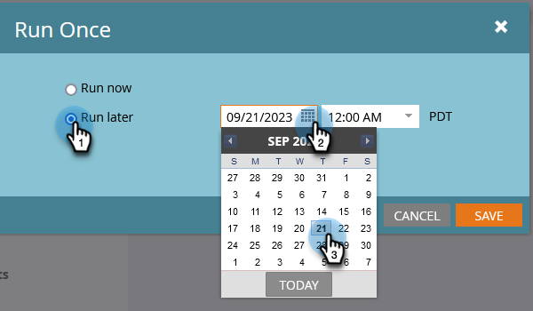

# Programar uma campanha inteligente em lote para execução posterior {#schedule-a-batch-smart-campaign-to-run-later}

Se você quiser definir que uma Campanha em Lote seja executada em algum momento no futuro, veja como.

>[!TIP]
>
>Você também pode [reagendar uma campanha inteligente em lotes na exibição de agendamento de programa](/help/marketo/product-docs/core-marketo-concepts/programs/program-schedule-view/reschedule-a-batch-smart-campaign-in-the-program-schedule-view.md){target="_blank"}.

1. Selecione a campanha inteligente em lotes que deseja executar, vá para a guia **[!UICONTROL Agendar]** e clique em **[!UICONTROL Executar uma Vez]**.

   

1. Clique em **[!UICONTROL Executar depois]**, clique no ícone de calendário e selecione o dia em que deseja que a campanha inteligente seja executada.

   

1. Selecione o tempo em que deseja que a campanha inteligente seja executada (com um mínimo de 15 minutos de antecedência).

   

1. Clique em **[!UICONTROL Salvar]**.

   

1. Você pode confirmar a execução agendada na guia **[!UICONTROL Agendar]**.

   

   >[!NOTE]
   >
   >[Agendar uma Campanha em Lote Recorrente](/help/marketo/product-docs/core-marketo-concepts/smart-campaigns/using-smart-campaigns/schedule-a-recurring-batch-campaign.md){target="_blank"}
