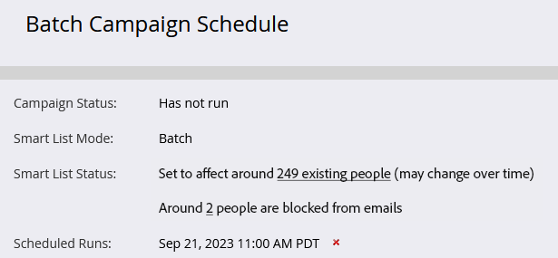

# Agendar uma Campanha inteligente em lote para ser executada mais tarde {#schedule-a-batch-smart-campaign-to-run-later}

Se você quiser definir uma campanha inteligente em lote para ser executada em algum ponto no futuro, veja como.

>[!TIP]
>
>Você também pode [reprogramar uma campanha inteligente em lote na exibição programação do programa](/help/marketo/product-docs/core-marketo-concepts/programs/program-schedule-view/reschedule-a-batch-smart-campaign-in-the-program-schedule-view.md).

1. Selecione a campanha inteligente em lote que deseja executar, vá para a **Agendar** e clique em **Executar uma vez**.

   

1. Clique em **Executar mais tarde**, clique no ícone do calendário e selecione o dia em que deseja que a campanha inteligente seja executada.

   

1. Selecione o horário em que deseja que a campanha inteligente seja executada (no mínimo, 15 minutos antes).

   

1. Clique em **Salvar**.

   

1. Você pode confirmar a execução agendada observando o **Agendar** guia .

   

   >[!NOTE]
   >
   >[Programar uma campanha em lote recorrente](/help/marketo/product-docs/core-marketo-concepts/smart-campaigns/using-smart-campaigns/schedule-a-recurring-batch-campaign.md)
