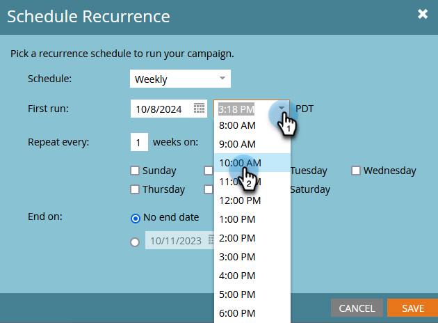

# Programar uma campanha em lote recorrente {#schedule-a-recurring-batch-campaign}

A Recorrência permite executar uma Campanha em Lote regularmente. Por exemplo - uma vez por semana, às terças-feiras às 10h.

1. Selecione a Campanha inteligente, vá para a página **[!UICONTROL Agendar]** e clique em **[!UICONTROL Agendar Recorrência]**.

   

1. Clique em **[!UICONTROL Agendar]** e selecione **[!UICONTROL Semanalmente]**.

   

1. Clique no ícone do calendário e selecione o dia desejado para a primeira execução.

   

1. Selecione a hora em que ele deve ser executado.

   

1. Sair &quot;[!UICONTROL Repetir a cada]&quot; como 1, selecione Terça-feira e clique em **[!UICONTROL Salvar]**.

   

   >[!NOTE]
   >
   >Para uma duração de execução específica, você pode clicar no ícone de calendário ao lado de **[!UICONTROL Encerra em]** e escolha a data final.

As recorrências agendadas são exibidas na parte inferior da guia Schedule.

>[!NOTE]
>
>A guia Schedule mostrará as próximas três ocorrências para referência. Clicar no vermelho **X** cancelará essa execução específica.
