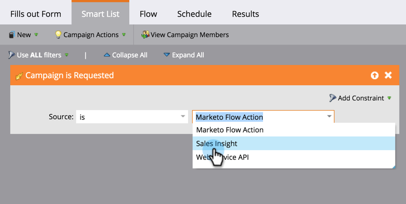

# Configurando uma Campanha inteligente de acionador para vendas usando &quot;Campanha é solicitada&quot; {#setting-up-a-trigger-smart-campaign-for-sales-using-campaign-is-requested}

Um dos recursos mais interessantes do Marketo é a capacidade de permitir que as pessoas de vendas participem do esforço de marketing. Eles estão nas linhas de frente, interagindo com as pessoas. Os representantes de vendas devem ter a capacidade de direcionar o marketing na direção certa.

>[!NOTE]
>
>**Exemplo**
>
>Exemplos de campanhas inteligentes para solicitar:
>
>1. **Longo prazo** - quando eles não têm orçamento este ano e você só quer ficar no radar
>1. **Ciclo** de vendas ativo - quando o vendedor não quiser mensagens para a pessoa, exceto suas próprias. (use o sinalizador suspenso de marketing para cancelar a inscrição temporariamente)

>
>
Seja criativo. O que o vendedor gostaria de automatizar? Apenas pergunte a eles e conecte-os!

1. Criar uma Campanha **inteligente.**

   

1. Localizar e arrastar a **Campanha** **é** **Solicitado **para a tela de desenho.

   

1. As opções de origem indicam que tipo de solicitação será honrada. Para a funcionalidade Salesforce, escolha **Sales** **Insight**.

   >[!TIP]
   >
   >Os operadores de origem são para segurança. Você pode restringir a campanha a solicitações feitas somente por fontes específicas, como outras campanhas inteligentes ou desenvolvedores. Escolha **É Qualquer** na primeira caixa se desejar permitir solicitações de todas as fontes.
   >
   >
   >**Lembre**-se de que ao escolher o Sales Insight, ele aparecerá magicamente na caixa de vendas. Não exagere. Muitos serão ignorados por eles.

   

Essa é uma excelente maneira de estender seu alcance de marketing para outros departamentos. Configure todos os tipos de campanhas para automatizar.

>[!TIP]
>
>Não esqueça de dar um nome claro às suas campanhas inteligentes. Eles aparecerão no Sales Insight exatamente como você os nomeia.

