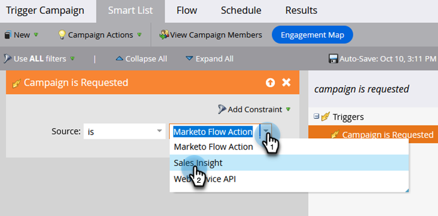

# Configurar uma campanha inteligente acionável para vendas usando “A campanha é solicitada” {#setting-up-a-trigger-smart-campaign-for-sales-using-campaign-is-requested}

Um dos recursos mais interessantes do Marketo é a capacidade de permitir que os vendedores participem do esforço de marketing. Eles estão na linha de frente, interagindo com as pessoas. Os representantes de vendas devem ter a capacidade de orientar o marketing na direção certa.

>[!NOTE]
>
>Exemplos de campanhas inteligentes a serem solicitadas:
>
>1. **Envelhecimento a longo prazo** - quando eles não têm orçamento este ano e você deseja permanecer no radar
>1. **Ciclo de vendas ativo** - quando o vendedor não deseja nenhuma mensagem para a pessoa, exceto a própria. (use o sinalizador de suspensão de marketing para cancelar a inscrição temporariamente)
>
>Pergunte à equipe de vendas o que ela gostaria de automatizar e configurar.

1. Crie uma campanha inteligente.

   

1. Localize e arraste o acionador **[!UICONTROL Campanha solicitada]** para a tela.

   

1. As opções de origem indicam que tipo de solicitação será atendida. Para a funcionalidade do Salesforce, escolha **[!UICONTROL Sales Insight]**.

   >[!TIP]
   >
   >Os operadores de origem são para segurança. Você pode restringir a campanha a solicitações feitas apenas por fontes específicas, como outras Campanhas inteligentes ou desenvolvedores. Escolha **[!UICONTROL É Qualquer]** na primeira caixa se desejar permitir solicitações de todas as fontes.
   >
   >_Lembre-se_: ao escolher Sales Insight, ele aparecerá magicamente na caixa de vendas. Evite adicionar muitas, pois elas serão ignoradas.

   

Essa é uma ótima maneira de estender o alcance de marketing para outros departamentos. Configure todos os tipos de campanhas para automatizar.

>[!TIP]
>
>Dê um nome mais claro às suas Campanhas inteligentes. Eles serão exibidos no Sales Insight exatamente como você os nomeará.
