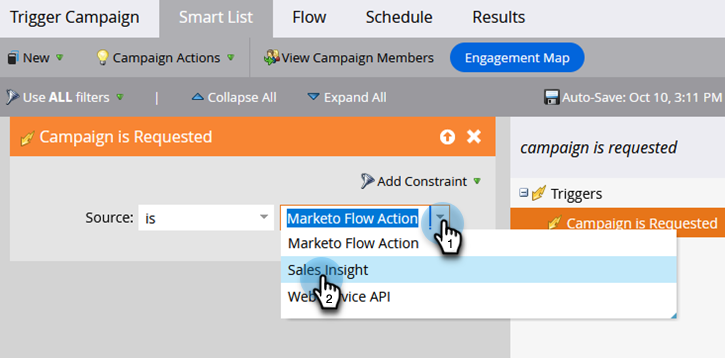

# Configurar um acionador de campanha inteligente para vendas usando &quot;A campanha é solicitada&quot; {#setting-up-a-trigger-smart-campaign-for-sales-using-campaign-is-requested}

Um dos recursos mais interessantes do Marketo é a capacidade de permitir que os vendedores participem do esforço de marketing. Eles estão na linha de frente, interagindo com as pessoas. Os representantes de vendas devem ter a capacidade de orientar o marketing na direção certa.

>[!NOTE]
>
>Exemplos de campanhas inteligentes a serem solicitadas:
>
>1. **Enriquecimento a longo prazo** - quando eles não têm um orçamento este ano e você só quer ficar no radar
>1. **Ciclo de vendas ativo** - quando o vendedor não quer mensagens para a pessoa, exceto as suas próprias. (use o sinalizador de suspensão de marketing para cancelar a inscrição temporariamente)
>
>Seja criativo. O que o vendedor gostaria de automatizar? Basta pedir-lhes e ligá-lo!

1. Crie uma campanha inteligente.

   

1. Localize e arraste o **[!UICONTROL A campanha é solicitada]** acione para a tela.

   

1. As opções de origem indicam que tipo de solicitação será atendida. Para a funcionalidade do Salesforce, escolha **[!UICONTROL Sales Insight]**.

   >[!TIP]
   >
   >Os operadores de origem são para segurança. Você pode restringir a campanha a solicitações feitas apenas por fontes específicas, como outras Campanhas inteligentes ou desenvolvedores. Escolher **[!UICONTROL É Qualquer]** na primeira caixa se desejar permitir solicitações de todas as fontes.
   >
   >_Lembrar_ Em seguida, ao escolher Sales Insight, ele será exibido magicamente na caixa para vendas. Não exagere. Muitos serão ignorados por eles.

   

Essa é uma ótima maneira de estender o alcance de marketing para outros departamentos. Configure todos os tipos de campanhas para automatizar.

>[!TIP]
>
>Não se esqueça de nomear suas Campanhas inteligentes com clareza. Eles aparecerão no Sales Insight exatamente como você os nomeia.
