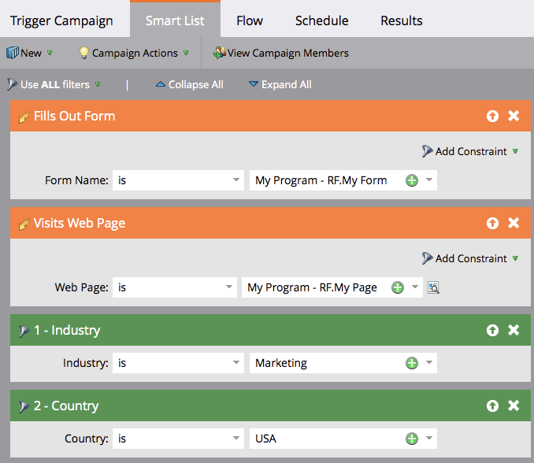

# Usando a lógica da regra de Lista inteligente padrão {#using-standard-smart-list-rule-logic}

Você pode ter notado a opção &quot;Usar filtros&quot; ao criar listas inteligentes de campanha. Essa configuração permite que você decida se os filtros precisam ser avaliados com um operador E ou OU.

>[!NOTE]
>
>**FYI**
>
>O Marketo agora está padronizando o idioma em todas as subscrições, portanto você pode ver o lead/lead na sua subscrição e a pessoa/pessoas em docs.marketo.com. Estes termos significam a mesma coisa. isso não afeta as instruções do artigo. Há outras mudanças também. [Saiba mais](http://docs.marketo.com/display/DOCS/Updates+to+Marketo+Terminology).

>[!NOTE]
>
>A alteração da lógica da regra de lista inteligente aplica-se somente a filtros, **não** acionadores.

Os acionadores são sempre avaliados como OU mesmo se a configuração acima estiver definida como ALL.  Veja um exemplo:

A lista inteligente acima em palavras:
`<pre data-theme="Confluence">IF person fills out My Form OR IF person visits My Page AND Industry is Marketing AND Country is USA THEN follow the campaign's flow step(s)</pre>` Assim, se uma pessoa preencher o formulário **ou** visitar a página, a campanha avaliará essa pessoa com base em **todos **ou **qualquer **qualquer **um dos filtros subsequentes, dependendo da configuração usada.

>[!NOTE]
>
>**Artigos relacionados**
>
>* [Usando a lógica avançada da regra de Lista inteligente](../../../../product-docs/core-marketo-concepts/smart-lists-and-static-lists/using-smart-lists/using-advanced-smart-list-rule-logic.md)

>

