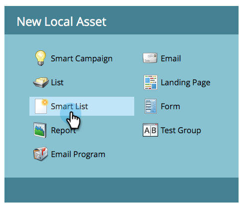

# Criar uma Lista inteligente {#create-a-smart-list}

As listas inteligentes permitem que você localize grupos específicos de pessoas usando filtros simples. Aqui está como criar um.

1. Vá para **Atividades de marketing**.

   

1. Selecione o programa no qual deseja criar a lista inteligente.
1. 

1. Em **Novo**, clique em **Novo ativo local**.

   

1. Selecione **Lista inteligente**.

   

1. Digite um **Nome** e clique em **Criar**.

   

   >[!NOTE]
   >
   >**Artigos relacionados**
   >
   >    
   >    
   >    * [Localizar e adicionar Filtros a uma Lista inteligente](find-and-add-filters-to-a-smart-list.md)

Ta-da, ótimo trabalho! Agora vamos adicionar e definir alguns filtros.