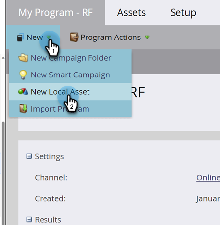
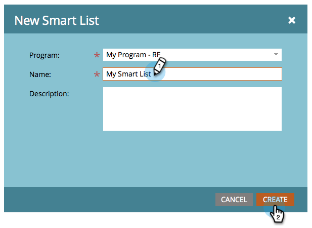

# Criar uma lista inteligente {#create-a-smart-list}

As Smart Lists permitem encontrar grupos específicos de pessoas usando filtros simples.

1. Acesse **[!UICONTROL Atividades de marketing]**.

   

1. Selecione o programa no qual deseja criar a Smart List.

   

1. Em **[!UICONTROL Novo]**, clique em **[!UICONTROL Novo ativo local]**.

   

1. Selecione **[!UICONTROL Smart List]**.

   

1. Insira um **[!UICONTROL Nome]** e clique em **[!UICONTROL Criar]**.

   

   Agora adicione e defina alguns filtros.

   >[!MORELIKETHIS]
   >
   >[Localizar e Adicionar Filtros a uma Lista Inteligente](/help/marketo/product-docs/core-marketo-concepts/smart-lists-and-static-lists/creating-a-smart-list/find-and-add-filters-to-a-smart-list.md){target="_blank"}
