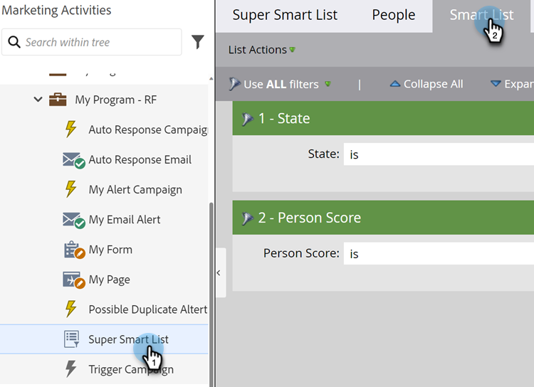

# Definir filtros da lista inteligente {#define-smart-list-filters}

>[!PREREQUISITES]
>
>* [Criar uma lista inteligente](/help/marketo/product-docs/core-marketo-concepts/smart-lists-and-static-lists/creating-a-smart-list/create-a-smart-list.md){target="_blank"}
>* [Localizar e Adicionar Filtros às Listas Inteligentes](/help/marketo/product-docs/core-marketo-concepts/smart-lists-and-static-lists/creating-a-smart-list/find-and-add-filters-to-a-smart-list.md){target="_blank"}

Agora que você [criou uma Smart List](/help/marketo/product-docs/core-marketo-concepts/smart-lists-and-static-lists/creating-a-smart-list/create-a-smart-list.md){target="_blank"} e [adicionou filtros](/help/marketo/product-docs/core-marketo-concepts/smart-lists-and-static-lists/creating-a-smart-list/find-and-add-filters-to-a-smart-list.md){target="_blank"} a ela, vamos definir os filtros. Veja como.

Continuando nosso exemplo, vamos definir esses filtros para encontrar todas as pessoas na Califórnia com uma pontuação acima de 50.

1. Vá para **[!UICONTROL Atividades de marketing]**.

   

1. Selecione a Smart List desejada e clique na guia **[!UICONTROL Smart List]**.

   

1. Localize e selecione &quot;CA&quot; para o filtro **[!UICONTROL Estado]**.

   

   >[!NOTE]
   >
   >Você pode estar armazenando &quot;Califórnia&quot; e &quot;CA&quot;. Para filtrar ambos os valores e incluir _todos_ pessoas da Califórnia, saiba como [adicionar vários valores a um filtro de Smart List](/help/marketo/product-docs/core-marketo-concepts/smart-lists-and-static-lists/using-smart-lists/add-multiple-values-to-a-smart-list-filter.md){target="_blank"}.

1. Escolha o operador **[!UICONTROL maior que]** e digite &quot;50&quot;.

   

>[!TIP]
>
>Se você acha que pode ter alguns registros no banco de dados que contêm endereços de email incompletos (por exemplo, apenas &quot;@adobe.com&quot;), use dois filtros de Endereço de email quando estiver usando o operador &quot;contains&quot;. Um filtro com &quot;contém @adobe.com&quot; e um filtro separado com &quot;contém adobe.com&quot; (deixando de fora o símbolo @).

Agora você sabe como criar uma Smart List e adicionar/definir filtros.
