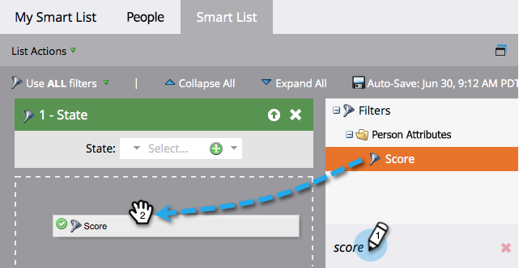

# Localizar e adicionar filtros a uma lista inteligente {#find-and-add-filters-to-a-smart-list}

Depois de [criar uma Smart List](/help/marketo/product-docs/core-marketo-concepts/smart-lists-and-static-lists/creating-a-smart-list/create-a-smart-list.md){target="_blank"}, é necessário adicionar e [definir](/help/marketo/product-docs/core-marketo-concepts/smart-lists-and-static-lists/creating-a-smart-list/define-smart-list-filters.md){target="_blank"} filtros.

Neste exemplo, o objetivo é encontrar todas as pessoas na Califórnia com uma pontuação acima de 50.

>[!TIP]
>
>Explore a árvore à direita: os filtros são muito eficientes e têm uma grande variedade de funções possíveis.

1. Acesse **[!UICONTROL Atividades de marketing]**.

   

1. Selecione a Smart List à qual deseja adicionar filtros e clique na guia **[!UICONTROL Smart List]**.

   

1. Localize e arraste o filtro **[!UICONTROL Estado]** para a tela.

   

1. Localize e arraste também o filtro **[!UICONTROL Pontuação]**.

   

Defina esses filtros.

>[!MORELIKETHIS]
>
>* [Criar uma lista inteligente](/help/marketo/product-docs/core-marketo-concepts/smart-lists-and-static-lists/creating-a-smart-list/create-a-smart-list.md){target="_blank"}
>* [Definir Filtros da Lista Inteligente](/help/marketo/product-docs/core-marketo-concepts/smart-lists-and-static-lists/creating-a-smart-list/define-smart-list-filters.md){target="_blank"}
