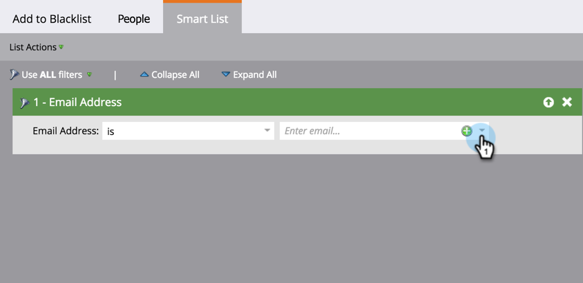

# Adicionar pessoa à Lista de bloqueios {#add-person-to-blocklist}

Adicionar pessoas à sua Lista de bloqueios impede que elas recebam sua correspondência.

>[!NOTE]
>
>O Marketo está mudando termos como Blacklist e Whitelist para Lista de bloqueios e Lista de permissões em nosso produto. Durante esta atualização, você pode ver os termos antigos em nossa interface do usuário e nas capturas de tela da documentação, bem como os novos termos em nosso texto de documentação. Pedimos desculpas por qualquer confusão.

1. [Crie um novo ](../../../../product-docs/core-marketo-concepts/programs/creating-programs/create-a-program.md) programa padrão e nomeie-o como  **Adicionar à Lista de bloqueios**.
1. Clique em **Novo** e selecione **Novo ativo local**.

   

1. Dê um nome à sua lista e clique em **Criar**.

   

1. Adicione todas as pessoas à sua **Lista inteligente** que deseja adicionar à sua Lista de bloqueios.

   >[!NOTE]
   >
   >As pessoas na sua Lista de bloqueios não receberão e-mails operacionais.

   

1. Clique em **Novo** e selecione **Nova Campanha inteligente**.

   

1. Nomeie a **Nova Campanha inteligente**. Clique em **Criar**.

   

1. Arraste e solte **Membro da Lista inteligente**.

   

1. Selecione a lista inteligente que você acabou de criar.

   

1. Arraste e solte **Alterar valor de dados**.

   

1. Para o **Fluxo**, digite **Bloquear Listado** para o **Atributo** e defina **Novo Valor** como **true**.

   

1. Na guia **Schedule**, selecione **Run Once**.

   

1. Selecione **Executar agora** e clique em **Executar**.

   

   É! Essas pessoas não receberão mais emails.

   >[!TIP]
   >
   >Crie uma [campanha inteligente de acionamento](../../../../product-docs/core-marketo-concepts/smart-campaigns/creating-a-smart-campaign/create-a-new-smart-campaign.md) usando **Alterar valor de dados** com **Bloqueio listado é verdadeiro** para todas as pessoas que no futuro têm atributos que podem ser  lista de bloqueios.

