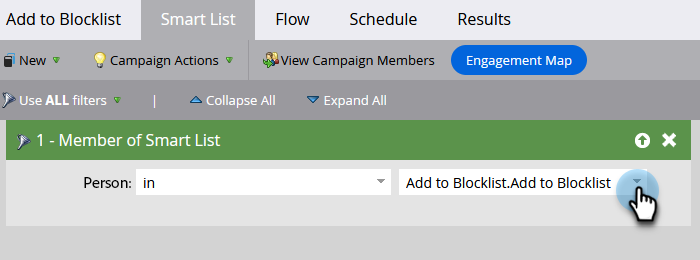
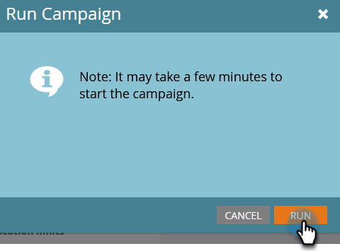

# Adicionar pessoa à Inclui na lista de bloqueios {#add-person-to-blocklist}

Adicionar pessoas à sua Inclui na lista de bloqueios as impede de receber sua correspondência.

1. Crie um novo [programa padrão](/help/marketo/product-docs/core-marketo-concepts/programs/creating-programs/create-a-program.md){target="_blank"} e nomeie-o como &quot;Adicionar ao arquivo de Inclui na lista de bloqueios&quot;.

1. Clique em **[!UICONTROL Novo]** e selecione **[!UICONTROL Novo ativo local]**.

   

1. Selecione **[!UICONTROL Smart List]**.

   

1. Nomeie sua lista e clique em **[!UICONTROL Criar]**.

   

1. Adicione todas as pessoas à lista inteligente que você deseja adicionar ao seu Incluo na lista de bloqueios.

   

   >[!NOTE]
   >
   >As pessoas na sua Inclui na lista de bloqueios não receberão emails operacionais.

1. Volte para o seu programa.

   

1. Clique em **[!UICONTROL Novo]** e selecione **[!UICONTROL Nova campanha inteligente]**.

   

1. Dê um nome à nova Campanha inteligente. Clique em **[!UICONTROL Criar]**.

   

1. Arraste e solte **[!UICONTROL Membro da Smart List]**.

   

1. Selecione a lista inteligente que acabou de criar.

   

1. Clique na guia **[!UICONTROL Fluxo]**. Arraste e solte a Ação de Fluxo **[!UICONTROL Alterar Valor de Dados]**.

   

1. No menu suspenso **[!UICONTROL Atributo]**, selecione **[!UICONTROL Bloqueio Listado]** e defina **[!UICONTROL Novo Valor]** como **[!UICONTROL true]**.

   

1. Clique na guia **[!UICONTROL Agendar]** e selecione **[!UICONTROL Executar Uma Vez]**.

   

1. Selecione **[!UICONTROL Executar agora]** e clique em **[!UICONTROL Executar]**.

   

1. Clique em **[!UICONTROL Executar]** novamente.

   

Essas pessoas não receberão mais emails.

>[!TIP]
>
>Crie uma [Campanha de Acionador](/help/marketo/product-docs/core-marketo-concepts/smart-campaigns/creating-a-smart-campaign/create-a-new-smart-campaign.md){target="_blank"} usando **Alterar Valor de Dados** com **A Lista de Bloqueios é verdadeira** para todas as pessoas no futuro que tiverem atributos habilitados para inclui na lista de bloqueios.
