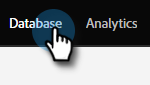

# Painel de banco de dados {#database-dashboard}

O Painel de controle do banco de dados serve como um instantâneo para ajudá-lo a determinar rapidamente os principais atributos sobre suas pessoas em um espaço de trabalho.

>[!NOTE]
>
>* O Painel do banco de dados é atualizado automaticamente a cada 24-32 horas. Você pode executar uma atualização manual a qualquer momento clicando no texto &quot;última atualização&quot; no lado direito da tela.
>
>* Cada espaço de trabalho tem seu próprio painel de banco de dados.

Para chegar lá, selecione **[!UICONTROL Banco de Dados]** em Minha Marketo.

Os gráficos indicam o número total de pessoas, o número de pessoas comercializáveis, bem como as cinco principais fontes de aquisição de pessoas. Passe o mouse sobre as áreas verdes para obter mais detalhes.

>[!TIP]
>
>Deseja obter informações mais específicas ou oportunas sobre seu pessoal? Experimente um [Relatório de Desempenho de Pessoas](/help/marketo/product-docs/reporting/basic-reporting/report-types/people-performance-report.md){target="_blank"}.

**Total de Pessoas:** O número de pessoas de todas as horas do espaço de trabalho listado.

incluir na lista de bloqueios **Pessoas Comercializáveis:** o número total de pessoas do espaço de trabalho listadas, _menos o seguinte_: pessoas sem um endereço de email, pessoas cujo email foi rejeitado, pessoas que estão registradas, pessoas que cancelaram a assinatura, pessoas atualmente definidas como Marketing Suspenso.
