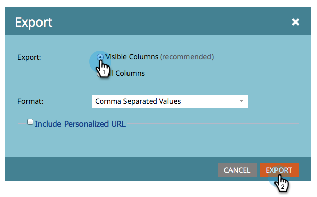

# Exportar pessoas de uma lista ou lista inteligente para o Excel {#export-people-to-excel-from-a-list-or-smart-list}

Se você precisar de resultados de listas ou Smart Lists fora do Marketo, poderá exportar facilmente para o Excel. Veja como.

1. Vá para **[!UICONTROL Atividades de marketing]**.

   

1. Selecione a lista ou lista inteligente que deseja exportar e vá para a guia **[!UICONTROL Pessoas]**.

   

1. Na parte inferior da página, clique no ícone do Excel.

   

1. Selecione **[!UICONTROL Colunas Visíveis]** e clique em **[!UICONTROL Exportar]**.

   

   >[!NOTE]
   >
   >Se você escolher **[!UICONTROL Todas as colunas]**, a exportação será maior em tamanho e levará mais tempo para gerar/baixar.

   >[!TIP]
   >
   >Se os registros de pessoa contiverem caracteres estrangeiros que não são renderizados corretamente na exportação, tente alterar o tipo de arquivo no menu suspenso **[!UICONTROL Formato]**.

1. A exportação será executada. Depois de concluído, você pode clicar em **[!UICONTROL Baixar agora]** para capturar o arquivo.

   

   >[!TIP]
   >
   >Se a exportação demorar um pouco, você sempre poderá fazer logoff e voltar a ela mais tarde. O link **[!UICONTROL Baixar agora]** pode ser acessado selecionando **[!UICONTROL Mostrar Status de Exportação]** no menu **[!UICONTROL Ações de Lista]**, e é válido por uma semana.
