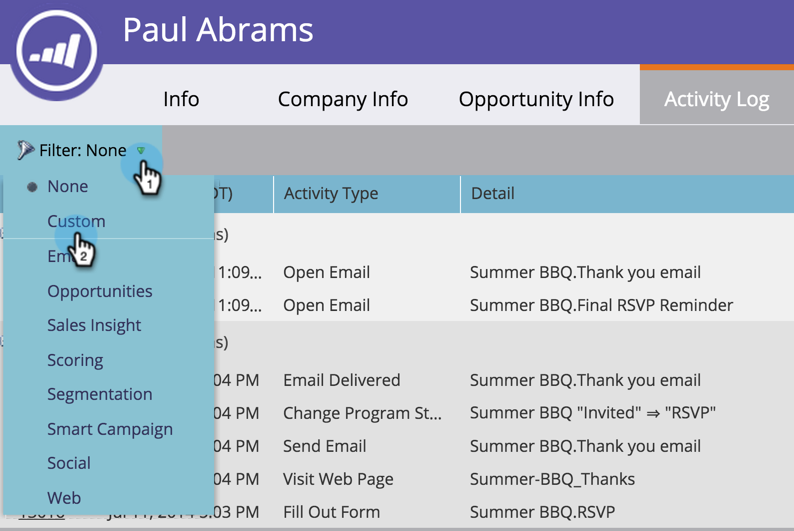

# Filtrar tipos de atividade no log de atividades de uma pessoa {#filter-activity-types-in-the-activity-log-of-a-person}

Procure atividades que são mais importantes para você no registro de atividades.

>[!NOTE]
>
>Saiba mais sobre [o log de atividades](/help/marketo/product-docs/core-marketo-concepts/smart-lists-and-static-lists/managing-people-in-smart-lists/locate-the-activity-log-for-a-person.md){target="_blank"}.

1. Vá para a página Detalhes da Pessoa. Clique na guia **[!UICONTROL Log de atividades]**.

   

1. Selecione o menu suspenso **[!UICONTROL Filtro]**.

   

## Criação de filtros personalizados {#creating-custom-filters}

1. Clique no menu suspenso **[!UICONTROL Filtro]**. Selecione **[!UICONTROL Personalizado]**.

   

1. Selecione atividades para filtrar. Clique em **[!UICONTROL Salvar como]**.

   

1. Insira um **[!UICONTROL nome de filtro personalizado]**. Clique em **[!UICONTROL Salvar]**.

   

   Agora, somente as atividades de pessoas que atendem aos critérios do filtro são exibidas.

   

## Filtros salvos de referência {#reference-saved-filters}

Filtros salvos podem ser acessados no menu suspenso [!UICONTROL Filtro].

1. Clique no menu suspenso **[!UICONTROL Filtros]**. Selecione **[!UICONTROL Personalizado]**.

   

1. Clique em **[!UICONTROL Filtros Salvos]**. Os filtros salvos estão listados abaixo.

   
