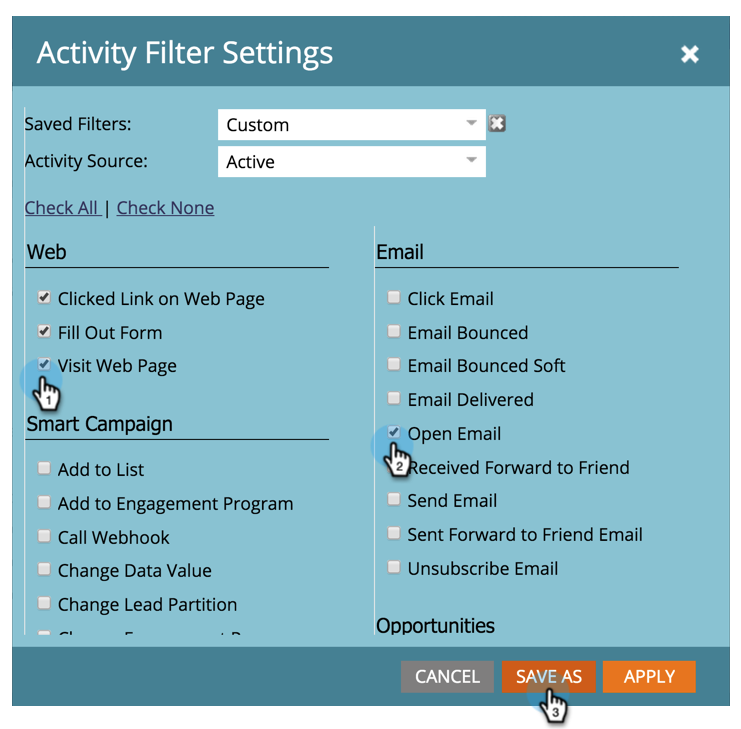

# Filtrar tipos de atividade no registro de atividades de uma pessoa {#filter-activity-types-in-the-activity-log-of-a-person}

Procure atividades que são mais importantes para você no registro de atividades.

>[!NOTE]
>
>Saiba mais sobre [o registro de atividades](/help/marketo/product-docs/core-marketo-concepts/smart-lists-and-static-lists/managing-people-in-smart-lists/locate-the-activity-log-for-a-person.md).

1. Vá para a **Detalhes da pessoa** página. Clique em **Log de atividades** guia.

   

1. Selecione o **Filtro** menu suspenso.

   

## Criação de filtros personalizados {#creating-custom-filters}

1. Clique em **Filtro** menu suspenso. Selecionar **Personalizado**.

   

1. Selecione atividades para filtrar. Clique em **Salvar como**.

   

1. Insira um **nome do filtro personalizado**. Clique em **Salvar**.

   

   Agora, somente as atividades de pessoas que atendem aos critérios do filtro são exibidas.

   

## Filtros salvos de referência {#reference-saved-filters}

Filtros salvos podem ser acessados no **Filtro** menu suspenso.

1. Clique em **Filtros** menu suspenso. Selecionar **Personalizado**.

   

1. Clique em **Filtros salvos**. Os filtros salvos estão listados abaixo.

   
