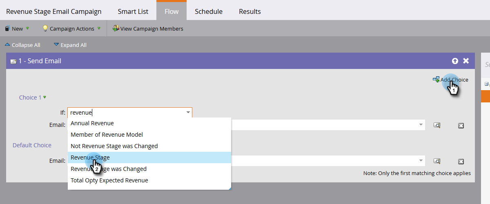

# Localizar todas as pessoas em um estágio de receita {#find-all-people-in-a-revenue-stage}

>[!PREREQUISITES]
>
>* [Criar uma Lista inteligente](../../../../product-docs/core-marketo-concepts/smart-lists-and-static-lists/creating-a-smart-list/create-a-smart-list.md)

>

## Localizar Todos os Membros de uma Etapa de Receita Específica {#find-all-members-of-a-specific-revenue-stage}

1. Em uma lista inteligente, clique na guia **Lista inteligente **, localize o filtro Estágio **da** receita e arraste-o para a tela.

   

1. Selecione um Estágio **de** Receita.

   

1. Vá até a guia **Pessoas** para visualização dos resultados.

   

## Executar uma Etapa de Fluxo nos Membros de uma Etapa de Receita {#run-a-flow-step-on-the-members-of-a-revenue-stage}

Agora que você sabe quais pessoas estão em quais estágios de receita, você pode comercializar diretamente para eles. Além de escolher a Etapa **da** receita como um filtro de lista inteligente, você também pode escolhê-la como um filtro &quot;if&quot; no fluxo.

1. Na etapa de fluxo desejada, clique em **Adicionar escolha** e selecione **Estágio** de receita no menu suspenso.

   

   A partir daí, é possível escolher quais membros serão afetados por qual aspecto da etapa de fluxo. Diversão!

