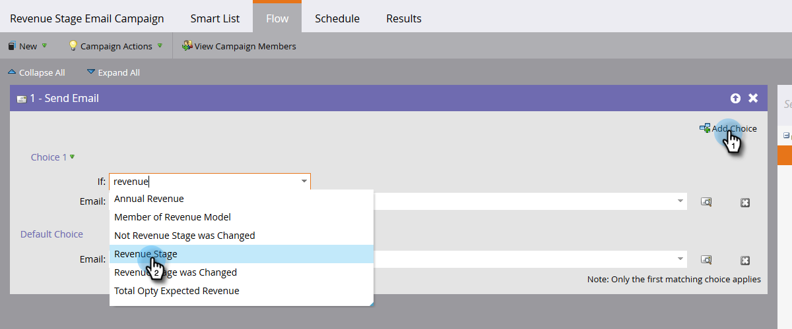

# Encontrar todas as pessoas em um estágio de receita {#find-all-people-in-a-revenue-stage}

>[!PREREQUISITES]
>
>[Criar uma lista inteligente](/help/marketo/product-docs/core-marketo-concepts/smart-lists-and-static-lists/creating-a-smart-list/create-a-smart-list.md){target="_blank"}

## Localizar todos os membros de um estágio de receita específico {#find-all-members-of-a-specific-revenue-stage}

1. Em uma Smart List, clique na guia **[!UICONTROL Smart List]**, localize o filtro **[!UICONTROL Estágio da Receita]** e arraste-o para a tela.

   

1. Selecione um **[!UICONTROL Estágio da receita]**.

   

1. Vá para a guia **[!UICONTROL Pessoas]** para ver os resultados.

   

## Executar uma Etapa de Fluxo nos Membros de um Estágio de Receita {#run-a-flow-step-on-the-members-of-a-revenue-stage}

Agora que você sabe quais pessoas estão em quais estágios de receita, você pode vender diretamente para elas. Além de escolher o **[!UICONTROL Estágio da Receita]** como um filtro de Smart List, você também pode selecioná-lo como um filtro &quot;if&quot; no fluxo.

1. Na etapa de fluxo desejada, clique em **[!UICONTROL Adicionar opção]** e selecione **[!UICONTROL Estágio da receita]** no menu suspenso.

   

   A partir daí, você pode escolher quais membros são afetados por qual aspecto da etapa de fluxo.
