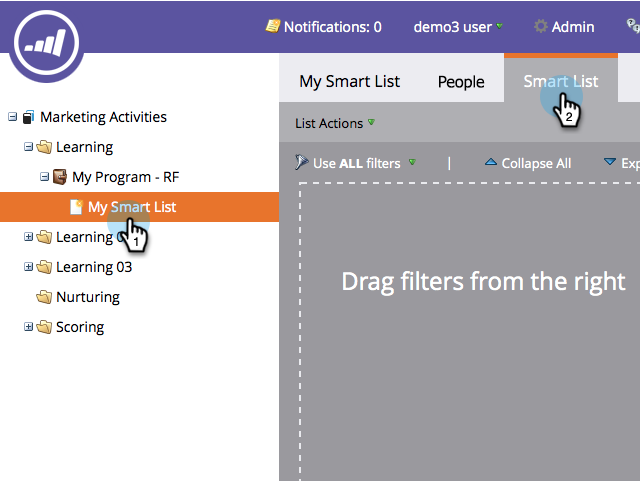

# Localizar pessoas duplicadas com lógica personalizada {#find-duplicate-people-with-custom-logic}

O Marketo Engage tem uma Lista inteligente de sistemas que encontra pessoas duplicadas ao corresponder seus endereços de email. Se quiser usar outro campo para localizar duplicatas, veja como.

>[!PREREQUISITES]
>
>[Criar uma lista inteligente](/help/marketo/product-docs/core-marketo-concepts/smart-lists-and-static-lists/creating-a-smart-list/create-a-smart-list.md){target="_blank"}

1. Vá para a área **[!UICONTROL Atividades de marketing]**.

1. Selecione sua Smart List, clique na guia **[!UICONTROL Smart List]**.

   

1. Localize e arraste o filtro **[!UICONTROL Duplicar Campos]** para a tela.

   

1. Escolha uma das quatro opções disponíveis:

   * [!UICONTROL Endereço de email]
   * [!UICONTROL Nome completo]
   * [!UICONTROL Sobrenome]
   * [!UICONTROL Atualizado Em]

   >[!NOTE]
   >
   >Todos os campos, com exceção do Endereço de email, fazem distinção entre maiúsculas e minúsculas. Portanto, o uso de &quot;john doe&quot; no campo Nome Completo _não_ retornaria resultados para John Doe.

   

   Concluído! Execute a Smart List para localizar pessoas com o mesmo valor no campo selecionado anteriormente.
