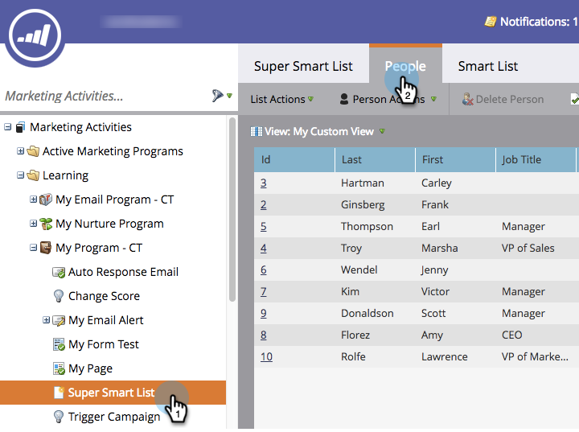

# Usar a localização rápida em uma lista ou lista inteligente {#use-quick-find-in-a-list-or-smart-list}

Localize uma pessoa nos resultados de uma lista ou Smart List usando a localização rápida.

1. Acesse **[!UICONTROL Atividades de marketing]**.

   

1. Selecione a Smart List que deseja pesquisar e clique na guia **[!UICONTROL Pessoas]**.

   

## Localizar Pessoas Usando Informações Pessoais {#find-people-using-personal-info}

1. Na caixa **[!UICONTROL Localização Rápida]**, na parte inferior da tela, digite uma palavra-chave (**nome pessoal**, **endereço de email** ou **cargo**).

   

1. Pressione Enter ou clique no ícone de pesquisa e pronto.

## Localizar pessoas usando o nome de uma empresa {#find-people-using-a-company-name}

1. Para localizar uma empresa, digite `[company]` na caixa Localização Rápida, seguido de qualquer parte do nome da empresa que você está procurando.

   

1. Pressione Enter ou clique no ícone de pesquisa e pronto.
