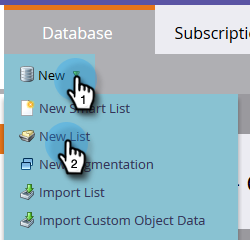

# Criar uma lista estática {#create-a-static-list}

Listas estáticas são um grupo de pessoas já no banco de dados.

1. Ir para **[!UICONTROL Banco de Dados]**.

   

1. Clique no menu suspenso **[!UICONTROL Novo]** e selecione **[!UICONTROL Nova lista]**.

   

1. Escolha uma pasta de destino, dê um nome à nova lista e clique em **[!UICONTROL Criar]**.

   

   Agora você tem uma lista vazia pronta para ser preenchida. Saiba como adicionar pessoas [aqui](/help/marketo/product-docs/core-marketo-concepts/smart-lists-and-static-lists/static-lists/understanding-static-lists.md#ways-to-add-remove-people-from-a-list){target="_blank"}.

   >[!NOTE]
   >
   >Você pode adicionar uma pessoa à sua lista quantas vezes desejar, mas elas só aparecerão uma vez. As pessoas permanecem na lista até que você as remova.
