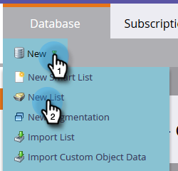

# Criar uma Lista estática {#create-a-static-list}

As listas estáticas são um grupo de pessoas que já estão em seu banco de dados. Aqui está como criar um.

1. Vá para **Banco de Dados**.

   

1. Clique no menu suspenso **Novo** e selecione **Nova Lista**.

   

1. Escolha uma pasta de destino, dê um nome à sua nova lista e clique em **Criar**.

   

   Agora você tem uma lista vazia pronta para ser preenchida. Saiba como adicionar pessoas [aqui](/help/marketo/product-docs/core-marketo-concepts/smart-lists-and-static-lists/static-lists/understanding-static-lists.md#ways-to-add-remove-people-from-a-list).

   >[!NOTE]
   >
   >Você pode adicionar uma pessoa à sua lista quantas vezes desejar, mas elas só aparecerão uma vez. As pessoas permanecem na lista até que você as remova.
