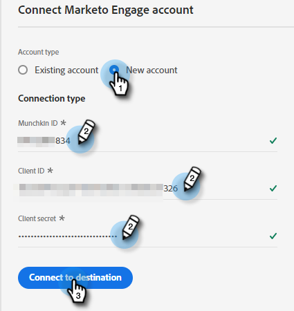
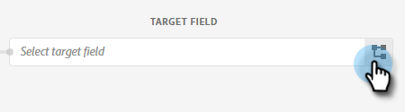

# Encaminhar um segmento do Adobe Experience Platform para uma lista estática do Marketo {#push-an-adobe-experience-platform-segment-to-a-marketo-static-list}

Esse recurso permite que você envie segmentos localizados no Adobe Experience Platform para o Marketo no formato de uma lista estática.

>[!PREREQUISITES]
>
>* [Crie um ](/help/marketo/product-docs/administration/users-and-roles/create-an-api-only-user.md) usuário de API no Marketo.
>* Em seguida, vá para **Admin** > **Launchpoint**. Encontre o nome da função que acabou de criar e clique em **Ver Detalhes**. Copie e salve as informações em **Client ID** e **Client Secret**, pois será necessário para esse recurso.

1. Faça logon em [Adobe Experience Platform](https://experience.adobe.com/).

   

1. Clique no ícone de grade e selecione **Experience Platform**.

   

1. Na navegação à esquerda, clique em **Destinations**.

   

1. Clique em **Catálogo**.

   

1. Localize o bloco Marketo Engage e clique em **Ativar segmentos**.

   

1. Clique em **Configurar novo destino**.

   PICC

1. Em Tipo de conta, clique no botão de opção **Nova conta**. Insira suas credenciais do Marketo e clique em **Conectar ao destino**.

   

   >[!NOTE]
   >
   >Você pode encontrar a ID do Munchkin acessando **Admin** > **Munchkin** (também faz parte do URL do Marketo uma vez conectado). ID do cliente/Segredo é necessário seguir os pré-requisitos na parte superior deste artigo.

1. &quot;Conectado&quot; deve aparecer abaixo de suas credenciais. Clique em **Next** no canto superior direito.

   

1. Insira um **Name** e uma _opcional_ Descrição. Clique em **Criar destino**.

   >[!NOTE]
   >
   >Escolher algo das Ações de marketing também é opcional. A Marketo não utiliza essas informações no momento, mas provavelmente usará em breve.

   

1. Clique em **Next**.

   

1. Escolha o segmento desejado e clique em **Next**.

   

   >[!NOTE]
   >
   >Segmentos para listas estáticas são 1:1. Caso escolha vários segmentos, será necessário mapear cada segmento para uma lista estática especificada na guia Agendamento de segmento.

1. Clique em **Adicionar Novo Mapeamento**.

   

1. Clique no ícone do cursor.

   

1. Escolha o botão de opção **Selecionar Atributos** ou **Selecionar Namespace de Identidade** (neste exemplo, estamos escolhendo Atributos).

   

   >[!NOTE]
   >
   >Se você escolheu **Selecionar namespace de identidade**, depois de fazer sua seleção, pule para a Etapa 15.

1. Escolha o campo relevante que contém o endereço de email que identifica o usuário. Clique em **Selecionar** quando terminar.

   

   

   >[!NOTE]
   >
   >O exemplo que escolhemos pode ser muito diferente de sua seleção.

1. Clique no ícone de mapeamento.

   

1. Escolha o Campo de Destino e clique em **Selecionar**.

   

1. Clique em **Next**.

   

   >[!NOTE]
   >
   >As identidades são usadas para procurar correspondências no Marketo. Se uma correspondência for encontrada, a pessoa será adicionada à Lista estática. Se uma correspondência não for encontrada, essas pessoas serão descartadas (ou seja, não serão criadas no Marketo).

1. _No Marketo_, crie uma lista estática ou localize e selecione uma que já tenha criado. Copie a ID de mapeamento do final do URL.

   

   >[!NOTE]
   >
   >Para obter melhores resultados, verifique se a lista referenciada no Marketo está vazia.

1. De volta ao Adobe Experience Platform, insira a ID que você acabou de copiar. Escolha a Data de início. As pessoas sincronizarão continuamente até a data de término escolhida. Para uma sincronização indefinida, deixe a data final em branco. Clique em **Next** quando terminar.

   

1. Confirme as alterações e clique em **Finish**.

   
