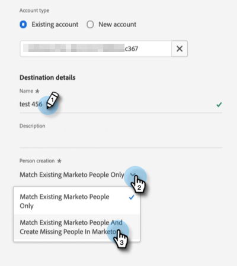

# Encaminhar um segmento do Adobe Experience Platform para uma lista estática do Marketo {#push-an-adobe-experience-platform-segment-to-a-marketo-static-list}

Esse recurso permite enviar segmentos localizados no Adobe Experience Platform para o Marketo Engage no formato de uma lista estática.

>[!PREREQUISITES]
>
>* [Edite a Função de API](/help/marketo/product-docs/administration/users-and-roles/create-delete-edit-and-change-a-user-role.md#edit-an-existing-role){target="_blank"} para verificar se ela tem a permissão **Pessoa de Leitura-Gravação** (localizada no menu suspenso Access API).
>* [Criar um Usuário de API](/help/marketo/product-docs/administration/users-and-roles/create-an-api-only-user.md){target="_blank"} no Marketo.
>* Vá para **[!UICONTROL Admin]** > **[!UICONTROL Launchpoint]**. Encontre o nome da função que você acabou de criar e clique em **[!UICONTROL Exibir Detalhes]**. Copie e salve as informações na **[!UICONTROL ID do Cliente]** e no **[!UICONTROL Segredo do Cliente]**, como você poderia precisar para a Etapa 7.
>* No Marketo, crie uma lista estática ou localize e selecione uma que você já criou. Você precisará da ID dele.

1. Faça logon no [Adobe Experience Platform](https://experience.adobe.com/){target="_blank"}.

   

1. Clique no ícone de grade e selecione **[!UICONTROL Experience Platform]**.

   

1. Na navegação à esquerda, clique em **[!UICONTROL Destinos]**.

   

1. Clique em **[!UICONTROL Catálogo]**.

   

1. Localize o bloco Marketo Engage e clique em **[!UICONTROL Ativar]**.

   

1. Clique em **[!UICONTROL Configurar novo destino]**.

   

1. Em Tipo de conta, selecione o botão de opção Conta existente ou Nova conta (neste exemplo, estamos escolhendo **[!UICONTROL Conta existente]**). Clique no ícone Selecionar conta.

   

   >[!NOTE]
   >
   >Se você estiver escolhendo Nova Conta, poderá encontrar sua Munchkin ID em **[!UICONTROL Admin]** > **[!UICONTROL Munchkin]** (também faz parte da URL da Marketo depois de conectado). ID/segredo do cliente que você deve ter seguindo os pré-requisitos na parte superior deste artigo.

1. Escolha a conta de destino e clique em **[!UICONTROL Selecionar]**.

   

1. Insira um **[!UICONTROL Nome]** de Destino e uma Descrição opcional. Clique na lista suspensa Criação de pessoas e escolha &quot;Corresponder pessoas existentes do Marketo e Criar pessoas ausentes no Marketo&quot; _ou_ &quot;Corresponder somente pessoas existentes do Marketo&quot; (neste exemplo, estamos escolhendo a primeira). Você também deve escolher um **[!UICONTROL Workspace]**.

   

   >[!NOTE]
   >
   >Se você escolher &quot;[!UICONTROL Corresponder somente a pessoas existentes do Marketo]&quot;, será necessário mapear somente o email e/ou a ECID, para que seja possível ignorar as etapas 13 a 16.

1. Esta seção é opcional. Clique em **[!UICONTROL Criar]** para ignorar.

   

1. Selecione o destino criado e clique em **[!UICONTROL Avançar]**.

   

1. Escolha o segmento que deseja enviar para o Marketo e clique em **[!UICONTROL Avançar]**.

   

   >[!NOTE]
   >
   >Se você escolher vários segmentos, será necessário mapear cada segmento para uma lista estática especificada na guia [!UICONTROL Agendamento de segmento].

   >[!IMPORTANT]
   >
   >Depois que um segmento é ativado para o destino do Marketo pela primeira vez, os perfis de preenchimento retroativo que já existiam no segmento antes da ativação do destino do Marketo podem levar _até 24 horas_. A partir de agora, sempre que perfis forem adicionados ao segmento, eles serão adicionados ao Marketo imediatamente.

1. Clique em **[!UICONTROL Adicionar Novo Mapeamento]**.

   

1. Clique no ícone de mapeamento.

   

1. Escolha o(s) atributo(s) desejado(s) e clique em **[!UICONTROL Selecionar]**. Neste exemplo, estamos escolhendo nome, sobrenome e endereço de email.

   

   >[!NOTE]
   >
   >Você pode mapear atributos do Experience Platform para qualquer um dos atributos aos quais sua organização tem acesso no Marketo Engage. Use a [Solicitação de API de Descrição](https://experienceleague.adobe.com/en/docs/marketo-developer/marketo/rest/lead-database/lead-database#describe){target="_blank"} para recuperar campos de atributo aos quais sua organização tem acesso.

1. Mapeie o Sobrenome e o Nome da Empresa clicando em **[!UICONTROL Adicionar Novo Mapeamento]** novamente e repita a Etapa 15 duas vezes, escolhendo **[!UICONTROL lastName]** e depois **[!UICONTROL companyName]**.

   

1. Agora é hora de mapear o endereço de email. Clique novamente em **[!UICONTROL Adicionar novo mapeamento]**.

   

1. Clique no ícone de mapeamento.

   

1. Clique no botão de opção Selecionar Namespace de Identidade, escolha **[!UICONTROL Email]** e clique em **[!UICONTROL Selecionar]**.

   

   >[!IMPORTANT]
   >
   >Mapear o email e/ou a ECID da guia **[!UICONTROL Namespace de identidade]** é a coisa mais importante a ser feita para garantir que a pessoa corresponda no Marketo. O mapeamento de email garantirá a mais alta taxa de correspondência.

1. Agora é hora de escolher os campos de origem. Para email, clique no ícone de cursor.

   

1. Clique no botão de opção Selecionar Namespace de Identidade, localize e selecione **[!UICONTROL Email]** e clique em **[!UICONTROL Selecionar]**.

   

1. Para escolher o campo de origem Nome da empresa, clique no ícone de cursor em sua linha.

   

1. Deixe marcado o botão de opção Selecionar atributos. Procure por &quot;empresa&quot; e selecione **[!UICONTROL companyName]** e clique em **[!UICONTROL Selecionar]**.

   

1. Mapeie os campos de origem para Sobrenome e Nome clicando no ícone de cursor para cada e repita a Etapa 23 duas vezes, escolhendo **[!UICONTROL lastName]** e depois **[!UICONTROL firstName]**.

   

1. Clique em **[!UICONTROL Avançar]**.

   

1. Revise suas alterações e clique em **[!UICONTROL Concluir]**.

   
