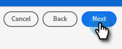

# Push Clone {#push-clone}

Esse recurso permite que você envie segmentos localizados no Adobe Experience Platform para o Marketo no formato de uma lista estática.

>[!PREREQUISITES]
>
>* [Criar um usuário de API](/help/marketo/product-docs/administration/users-and-roles/create-an-api-only-user.md) no Marketo.
>* Em seguida, vá para **Administrador** > **Launchpoint**. Encontre o nome da função que acabou de criar e clique em **Exibir detalhes**. Copie e salve as informações em **ID do cliente** e **Segredo do cliente**, pois será necessário para esse recurso.

1. Faça logon em [Adobe Experience Platform](https://experience.adobe.com/).

   

1. Clique no ícone de grade e selecione **Experience Platform**.

   

1. Na navegação à esquerda, clique em **Destinos**.

   

1. Clique em **Catálogo**.

   

1. Encontre o Marketo Engage e clique em **Ativar segmentos**.

   

1. Clique em **Configurar novo destino**.

1. Em Tipo de conta, escolha Conta existente ou **Nova conta** botão de opção (neste exemplo, estamos escolhendo **Nova conta**). Insira suas credenciais do Marketo.

   

   >[!NOTE]
   >
   >Você pode encontrar sua ID do Munchkin indo para **Administrador** > **Munchkin** (também faz parte do URL do Marketo depois de conectado). ID do cliente/Segredo é necessário seguir os pré-requisitos na parte superior deste artigo.

1. Em Criação de pessoas, escolha &quot;Corresponder somente pessoas existentes&quot; ou &quot;Corresponder pessoas existentes e Criar pessoas desaparecidas no Marketo.&quot; Nesta opção, escolhemos a última.

PICC

1. &quot;Conectado&quot; deve aparecer abaixo de suas credenciais. Clique em **Próximo** no canto superior direito.

   

1. Insira um **Nome** e um _opcional_ Descrição Clique em **Criar destino**.

   >[!NOTE]
   >
   >Escolher algo das Ações de marketing também é opcional. A Marketo não utiliza essas informações no momento, mas provavelmente usará em breve.

   

1. Clique em **Próximo**.

   

1. Escolha o segmento desejado e clique em **Próximo**.

   

   >[!NOTE]
   >
   >Caso escolha vários segmentos, será necessário mapear cada segmento para uma lista estática especificada na guia Agendamento de segmento.

1. Clique em **Adicionar novo mapeamento**.

   

1. Clique no ícone do cursor.

   

1. Escolha a variável **Selecionar atributos** ou **Selecionar Namespace de Identidade** botão de opção (neste exemplo, estamos escolhendo Atributos).

   

   >[!NOTE]
   >
   >Se você escolher **Selecionar Namespace de Identidade**, depois de fazer a seleção, pule para a Etapa 15.

1. Escolha o campo relevante que contém o endereço de email que identifica o usuário. Clique em **Selecionar** quando concluído.

   

   

   >[!NOTE]
   >
   >O exemplo que escolhemos pode ser muito diferente de sua seleção.

1. Clique no ícone de mapeamento.

   

1. Choose **Selecionar Namespace de Identidade**.

   

   >[!IMPORTANT]
   >
   >O mapeamento de atributos é opcional. Mapeamento de email e/ou ECID do **Namespace de identidade** A guia é a coisa mais importante a se fazer para garantir que a pessoa seja comparada no Marketo. Mapear email garantirá a maior taxa de correspondência.

1. Escolha entre ECID ou Email. Neste exemplo, estamos escolhendo **Email**.

   

1. Clique em **Próximo**.

   

   >[!NOTE]
   >
   >As identidades são usadas para procurar correspondências no Marketo. Se uma correspondência for encontrada, a pessoa será adicionada à Lista estática. Se uma correspondência não for encontrada, essas pessoas serão descartadas (ou seja, não serão criadas no Marketo).

1. _No Marketo_, crie uma lista estática ou localize e selecione uma que já tenha criado. Copie a ID de mapeamento do final do URL.

   

   >[!NOTE]
   >
   >Para obter melhores resultados, verifique se a lista referenciada no Marketo está vazia.

1. De volta ao Adobe Experience Platform, insira a ID que você acabou de copiar. Escolha a Data de início. As pessoas sincronizarão continuamente até a data de término escolhida. Para uma sincronização indefinida, deixe a data final em branco. Clique em **Próximo** quando concluído.

   

1. Confirme suas alterações e clique em **Concluir**.

   
