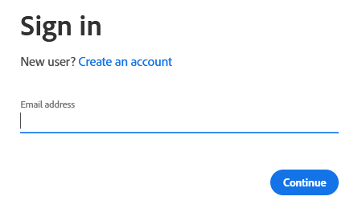
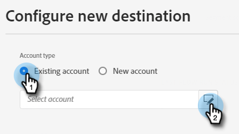

# Push Clone {#push-clone}

Esse recurso permite que você envie segmentos localizados no Adobe Experience Platform para o Marketo no formato de uma lista estática.

>[!PREREQUISITES]
>
>* [Criar um usuário de API](/help/marketo/product-docs/administration/users-and-roles/create-an-api-only-user.md) no Marketo.
>* Em seguida, vá para **Administrador** > **Launchpoint**. Encontre o nome da função que acabou de criar e clique em **Exibir detalhes**. Copie e salve as informações em **ID do cliente** e **Segredo do cliente**, pois será necessário para esse recurso.

1. Faça logon em [Adobe Experience Platform](https://experience.adobe.com/).

   

1. Clique no ícone de grade e selecione **Experience Platform**.

   

1. Na navegação à esquerda, clique em **Destinos**.

   

1. Clique em **Catálogo**.

   

1. Encontre o Marketo Engage e clique em **Ativar segmentos**.

   

1. Clique em **Configurar novo destino**.

   

1. Em Tipo de conta, selecione o botão de opção Conta existente ou nova (neste exemplo, estamos escolhendo **Conta existente**). Clique no ícone Selecionar conta .

   

1. Escolha a conta de destino e clique em **Selecionar**.

   

Em seguida, você terá que escolher se deseja corresponder somente às pessoas existentes do Marketo ou corresponder às pessoas existentes do Marketo e criar as pessoas desaparecidas no Marketo. Abaixo estão as seções que descrevem como fazer cada uma.

## Corresponder pessoas existentes do Marketo e criar pessoas ausentes no Marketo {#match-existing-marketo-people-create-missing-people}

Depois de seguir as Etapas 1 a 8 acima...

1. Inserir um destino **Nome** e uma Descrição opcional. Clique no menu suspenso Criação de pessoas e selecione **Corresponder pessoas existentes do Marketo e criar pessoas ausentes no Marketo**.

   

1. Esta seção é opcional. Clique em **Criar** para ignorar.

   

1. Selecione o destino criado e clique em **Próximo**.

   

1. Escolha o segmento que deseja enviar para o Marketo e clique em **Próximo**.

   

1. Clique em **Adicionar novo mapeamento**.

   

1. Clique no ícone de mapeamento.

   

1. Mapear o nome pela seleção **firstName** e clicando em **Selecionar**.

   

1. Mapeie o sobrenome e o nome da empresa clicando em **Adicionar novo mapeamento** novamente e repetindo a Etapa 7 duas vezes, escolhendo lastName e, em seguida, companyName.

   

1. Agora é hora de mapear o endereço de email. Clique em **Adicionar novo mapeamento** novamente.

   

1. Clique no ícone de mapeamento.

   

1. Clique no botão de opção Selecionar namespace de identidade e escolha  **Email**, depois clique em **Selecionar**.

   

1. Agora é hora de escolher os campos de origem. Para email, clique no ícone do cursor.

   

1. Clique no botão de opção Selecionar namespace de identidade , localize e selecione **Email**, depois clique em **Selecionar**.

   

MORREEEE

## Corresponder apenas a pessoas existentes do Marketo {#match-existing-marketo-people-only}

>[!NOTE]
>
>As identidades são usadas para procurar correspondências no Marketo. Se uma correspondência for encontrada, a pessoa será adicionada à Lista estática. Se uma correspondência não for encontrada, essas pessoas serão descartadas (ou seja, não serão criadas no Marketo).

1. _No Marketo_, crie uma lista estática ou localize e selecione uma que já tenha criado. Copie a ID de mapeamento do final do URL.

PICC

>[!NOTE]
>
>Para obter melhores resultados, verifique se a lista referenciada no Marketo está vazia.

1. De volta ao Adobe Experience Platform, insira a ID que você acabou de copiar. Escolha a Data de início. As pessoas sincronizarão continuamente até a data de término escolhida. Para uma sincronização indefinida, deixe a data final em branco. Clique em **Próximo** quando concluído.

PICC

1. Confirme suas alterações e clique em **Concluir**.

PICC
