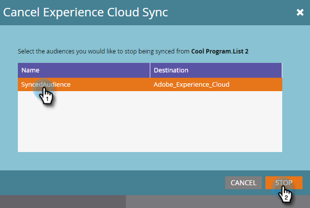

# Enviar uma lista para o Adobe Experience Cloud {#send-a-list-to-adobe-experience-cloud}

>[!NOTE]
>
>Uma implantação pronta para HIPAA de uma instância do Marketo não pode usar esse recurso.

>[!PREREQUISITES]
>
>[Configurar Mapeamento de Organização do Adobe](/help/marketo/product-docs/core-marketo-concepts/miscellaneous/set-up-adobe-organization-mapping.md)

## Aplicativos de destino suportados {#supported-destination-applications}

* Adobe Advertising Cloud
* Adobe Analytics (**only** se você possuir uma licença da Adobe Audience Manager)
* Adobe Audience Manager
* Adobe Experience Manager
* Adobe Real-time Customer Data Platform
* Adobe Target

## Como enviar uma lista estática {#how-to-send-a-static-list}

Uma lista estática é apenas isso, estática. Nenhuma alteração ocorrerá na lista no Adobe Experience Cloud, a menos que você as faça manualmente.

1. No Marketo, encontre a lista que deseja exportar. Clique com o botão direito do mouse e selecione **Enviar para o Experience Cloud**.

   

1. Clique no botão **Pasta Audience Manager** e selecione a pasta de destino desejada no Experience Cloud.

   

1. Escolha se deseja criar um novo público-alvo ou substituir um existente (neste exemplo, estamos criando um novo). Insira o novo nome do público-alvo e clique em **Enviar**.

   

1. Clique em **OK**.

   

   >[!NOTE]
   >
   >Pode levar de 6 a 8 horas para que a associação de público-alvo seja totalmente preenchida no Adobe.

## Como enviar uma lista sincronizada {#how-to-send-a-synced-list}

Sincronizar uma lista significa que a qualquer momento que você atualizar uma lista no Marketo, essa alteração é automaticamente sincronizada com seu público no Adobe Experience Cloud.

1. No Marketo, encontre a lista que deseja exportar. Clique com o botão direito do mouse e selecione **Enviar para o Experience Cloud**.

   

1. Clique no botão **Pasta da biblioteca de público-alvo** e selecione a pasta de destino desejada no Experience Cloud.

   

1. Escolha se deseja criar um novo público-alvo ou substituir um existente (neste exemplo, estamos criando um novo). Insira o novo nome do público-alvo, marque a opção **Manter associação de público-alvo sincronizado** e clique em **Enviar**.

   

1. Clique em **OK**.

   

## Como parar uma sincronização de lista {#how-to-stop-a-list-sync}

Você pode impedir a sincronização da lista a qualquer momento.

1. No Marketo, encontre e clique com o botão direito do mouse na lista que deseja parar de sincronizar. Clique em **Parar Sincronização da Lista**.

   

1. Selecione o(s) público(s) que deseja parar de ser sincronizado e clique em **Stop**.

   

1. Clique em **Stop** para confirmar.

   

## O que deve ser observado {#things-to-note}

**Compartilhamento para o Adobe Analytics**

Para clientes proprietários do Adobe Audience Manager e do Adobe Analytics, essa integração permitirá que os públicos-alvo sejam compartilhados do Marketo com seus Conjuntos de relatórios do Adobe Analytics, no entanto, há algumas etapas de configuração adicionais que precisam ser seguidas no Adobe Audience Manager para permitir isso. Consulte a documentação da Adobe Audience Manager para obter mais informações sobre como configurar isso: [https://experienceleague.adobe.com/docs/analytics/integration/audience-analytics/mc-audiences-aam.html](https://experienceleague.adobe.com/docs/analytics/integration/audience-analytics/mc-audiences-aam.html).

**Uso de características para clientes do Adobe Audience Manager**

Ao iniciar uma exportação de lista no Marketo, você observará as seguintes alterações refletidas em sua instância do Adobe Audience Manager:

* Para todos os Leads na Lista exportada, o Marketo gravará uma característica usando os emails com hash dos Leads como um Identificador entre dispositivos. O nome da característica corresponderá ao Nome de público-alvo de destino especificado durante a exportação.
* Para todas as ECIDs que o Marketo conseguiu corresponder aos Leads na Lista exportada, o Marketo gravará uma característica usando o Identificador de dispositivo ECID. O nome da característica corresponderá ao Nome de público-alvo de destino especificado durante a exportação.
* O Marketo também criará um segmento em sua Instância do Audience Manager usando a característica da ECID como o único critério de segmentação. O nome do segmento corresponderá ao Nome de público-alvo de destino que você especificou durante a exportação.

## Perguntas frequentes {#faq}

**Por que o tamanho da lista no Marketo é diferente do do Adobe?**

Sob o capô, a integração de público-alvo funciona sincronizando os cookies do Marketo Munchkin com o cookie Adobe ECID correspondente. A Marketo só pode compartilhar dados de associação para clientes potenciais para os quais a Marketo sincronizou uma ECID. Para obter os melhores resultados possíveis, é recomendável carregar o script de rastreamento munchkin.js do Marketo em paralelo com o código de rastreamento visitor.js do Adobe em todas as páginas que você está interessado em rastrear para fins de marketing.

**Como a sincronização de cookies funciona?**

Quando a sincronização de cookies estiver ativada para sua assinatura do Marketo, o munchkin.js da Marketo tentará capturar e armazenar Adobe ECIDs para a organização do Adobe IMS especificada durante a configuração da integração e corresponder essas ECIDs ao identificador de cookie do Marketo correspondente. Isso permite que perfis de usuário anônimos do Marketo sejam enriquecidos com Adobe ECIDs.

É necessária uma nova etapa para associar o perfil de usuário anônimo a um Perfil de cliente potencial, que é identificado usando um email de texto simples. Exatamente como isso funciona [descrito aqui](/help/marketo/product-docs/reporting/basic-reporting/report-activity/tracking-anonymous-activity-and-people.md).

**Quais informações são compartilhadas?**

Essa integração compartilha apenas informações de associação de listas do Marketo para o Adobe (por exemplo, o conhecimento de que o Lead X é membro da Lista Y). Nenhum atributo de lead adicional é compartilhado com o Adobe por meio dessa integração.
