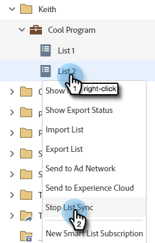

# Enviar uma lista para o Adobe Experience Cloud {#send-a-list-to-adobe-experience-cloud}

>[!NOTE]
>
>Uma implantação pronta para HIPAA de uma instância de Marketo Engage não pode usar esse recurso.

>[!PREREQUISITES]
>
>[Configurar Mapeamento da Organização Adobe](/help/marketo/product-docs/adobe-experience-cloud-integrations/set-up-adobe-organization-mapping.md){target="_blank"}

## Aplicativos de destino suportados {#supported-destination-applications}

* Adobe Advertising Cloud
* ADOBE ANALYTICS (_somente_ se você tiver uma licença do Adobe Audience Manager)
* Adobe Audience Manager
* Adobe Experience Manager
* Adobe Real-time Customer Data Platform
* Adobe Target

## Como enviar uma lista estática {#how-to-send-a-static-list}

Uma lista estática é exatamente isso, estática. Nenhuma alteração ocorrerá na lista no Adobe Experience Cloud, a menos que você as faça manualmente.

1. No Marketo, encontre a lista que deseja exportar. Clique com o botão direito do mouse e selecione **[!UICONTROL Enviar para o Experience Cloud]**.

   

1. Clique em **[!UICONTROL Pasta Audience Manager]** e selecione a pasta de destino desejada no Experience Cloud.

   

1. Escolha se deseja criar um novo público ou substituir um já existente (neste exemplo, estamos criando um novo). Insira o novo nome de público e clique em **[!UICONTROL Enviar]**.

   

1. Clique em **[!UICONTROL OK]**.

   

   >[!NOTE]
   >
   >Pode levar de 6 a 8 horas para que a associação de público-alvo seja totalmente preenchida no Adobe.

## Como enviar uma lista sincronizada {#how-to-send-a-synced-list}

Sincronizar uma lista significa que, sempre que você atualiza uma lista no Marketo, essa alteração é sincronizada automaticamente com o público-alvo no Adobe Experience Cloud.

1. No Marketo, encontre a lista que deseja exportar. Clique com o botão direito do mouse e selecione **[!UICONTROL Enviar para o Experience Cloud]**.

   

1. Clique em **[!UICONTROL Pasta da biblioteca de público-alvo]** e selecione a pasta de destino desejada no Experience Cloud.

   

1. Escolha se deseja criar um novo público ou substituir um já existente (neste exemplo, estamos criando um novo). Insira o novo nome de público-alvo, verifique a **[!UICONTROL Manter a associação de público-alvo em sincronia]** e clique em **[!UICONTROL Enviar]**.

   

1. Clique em **OK**.

   

## Como Interromper uma Sincronização de Lista {#how-to-stop-a-list-sync}

Você pode interromper a sincronização da sua lista a qualquer momento.

1. No Marketo, localize e clique com o botão direito do mouse na lista que deseja interromper a sincronização. Clique em **[!UICONTROL Parar Sincronização de Lista]**.

   

1. Selecione os públicos que você deseja parar de sincronizar e clique em **[!UICONTROL Parar]**.

   

1. Clique em **[!UICONTROL Parar]** para confirmar.

   

## Itens a Observar {#things-to-note}

**Compartilhamento no Adobe Analytics**

Para clientes que possuem o Adobe Audience Manager e o Adobe Analytics, essa integração permitirá que os públicos-alvo sejam compartilhados do Marketo com seus Conjuntos de relatórios do Adobe Analytics. No entanto, há algumas etapas de configurações adicionais que precisam ser executadas no Adobe Audience Manager para habilitar isso. Revise [Documentação da Adobe Audience Manager](https://experienceleague.adobe.com/docs/analytics/integration/audience-analytics/mc-audiences-aam.html){target="_blank"} para obter mais informações sobre como configurar isso.

**Uso de características para clientes do Adobe Audience Manager**

Ao iniciar uma exportação de lista no Marketo, você observará as seguintes alterações refletidas na instância do Adobe Audience Manager:

* Para todos os clientes em potencial na lista exportada, o Marketo gravará uma característica usando os emails com hash dos clientes em potencial como um Identificador entre dispositivos. O nome da característica corresponderá ao Nome do público-alvo de destino especificado durante a exportação.
* Para todas as ECIDs que a Marketo conseguiu corresponder aos clientes em potencial na lista exportada, o Marketo gravará uma característica usando o Identificador de dispositivo ECID. O nome da característica corresponderá ao Nome do público-alvo de destino especificado durante a exportação.
* O Marketo também criará um segmento na sua instância do Audience Manager usando a característica da ECID como o único critério de segmentação. O nome do segmento corresponderá ao Nome do público-alvo de destino especificado durante a exportação.

## Perguntas frequentes {#faq}

**Por que o tamanho da lista no Marketo é diferente do tamanho na Adobe?**

Por baixo dos panos, a integração do público-alvo funciona sincronizando os cookies do Marketo Munchkin com o cookie Adobe ECID correspondente. O Marketo só pode compartilhar dados de associação de clientes potenciais para os quais a Marketo sincronizou uma ECID. Para obter os melhores resultados possíveis, é recomendável carregar o script de rastreamento munchkin.js do Marketo em paralelo ao código de rastreamento de Adobe visitor.js em todas as páginas em que você está interessado em rastrear para fins de marketing.

**Como funciona a sincronização de cookies?**

Quando a sincronização de cookies estiver ativada para sua assinatura do Marketo, o munchkin.js da Marketo tentará capturar e armazenar ECIDs de Adobe para a Organização IMS da Adobe especificada durante a configuração de integração e corresponderá essas ECIDs ao identificador de cookie do Marketo correspondente. Isso permite que perfis de usuários anônimos da Marketo sejam enriquecidos com Adobe ECIDs.

Uma outra etapa é necessária para associar o perfil de usuário anônimo a um Perfil principal, que é identificado usando um email de texto sem formatação. Exatamente como isso funciona é [descrito aqui](/help/marketo/product-docs/reporting/basic-reporting/report-activity/tracking-anonymous-activity-and-people.md){target="_blank"}.

**Que informações são compartilhadas?**

Essa integração só compartilha informações de associação de lista da Marketo para o Adobe (por exemplo, o conhecimento de que o Lead X é um membro da Lista Y). Nenhum atributo de lead adicional é compartilhado com o Adobe por meio dessa integração.
