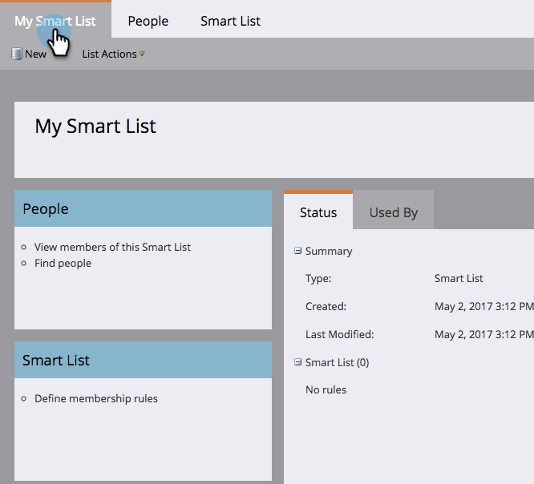

# Noções básicas sobre Smart Lists {#understanding-smart-lists}

As Smart Lists permitem encontrar grupos específicos de pessoas usando filtros simples. Eles são usados em todo o Marketo, como em Campanhas inteligentes, programas, relatórios, segmentações, modelos de negócios, programas de engajamento, conteúdo dinâmico e muito mais. Dependendo das suas necessidades, as Smart Lists podem ser criadas em dois locais no Marketo:

1. No **Banco de dados**, em que estão disponíveis para uso compartilhado/global (por exemplo, &quot;Todas as pessoas não inscritas&quot;).
1. Entrada **programas** como ativos locais, onde encontram um grupo de pessoas relevantes para esse programa específico (por exemplo, &quot;Participaram de feiras&quot;).

As principais etapas para criar uma Smart List são:

1. [Criar uma lista inteligente](/help/marketo/product-docs/core-marketo-concepts/smart-lists-and-static-lists/creating-a-smart-list/create-a-smart-list.md){target="_blank"}
1. [Localizar e adicionar filtros a uma lista inteligente](/help/marketo/product-docs/core-marketo-concepts/smart-lists-and-static-lists/creating-a-smart-list/find-and-add-filters-to-a-smart-list.md){target="_blank"}
1. [Definir filtros da lista inteligente](/help/marketo/product-docs/core-marketo-concepts/smart-lists-and-static-lists/creating-a-smart-list/define-smart-list-filters.md){target="_blank"}

Veja um exemplo de como uma Smart List se parece.

## Guia Principal {#main-tab}

Aqui você pode [editar o nome da Smart List](/help/marketo/product-docs/core-marketo-concepts/miscellaneous/rename-a-marketo-asset.md){target="_blank"} e consulte informações sobre a Smart List.

## Guia Pessoas {#people-tab}

É aqui que você vê os resultados; ou seja, todas as pessoas que se qualificam para os filtros que você [adicionado e definido](/help/marketo/product-docs/core-marketo-concepts/smart-lists-and-static-lists/creating-a-smart-list/find-and-add-filters-to-a-smart-list.md){target="_blank"} na guia Smart List.

## Guia Lista inteligente {#smart-list-tab}

Você adiciona e define os filtros para ver um grupo específico de pessoas na guia Pessoas.

OK, vamos começar!

>[!MORELIKETHIS]
>
>* [Usar Smart Lists Integradas/do Sistema](/help/marketo/product-docs/core-marketo-concepts/smart-lists-and-static-lists/using-smart-lists/use-built-in-system-smart-lists.md){target="_blank"}
>* [Criar uma lista inteligente](/help/marketo/product-docs/core-marketo-concepts/smart-lists-and-static-lists/creating-a-smart-list/create-a-smart-list.md){target="_blank"}
