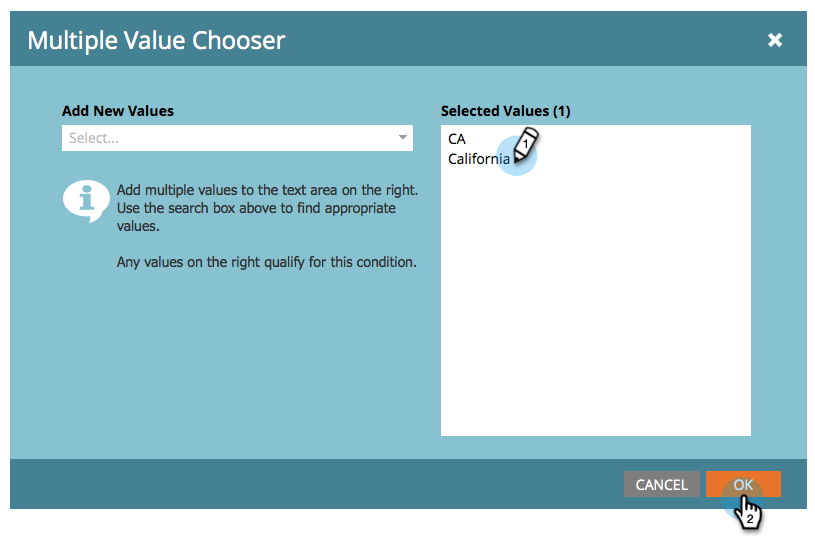

# Adicionar múltiplos valores a um filtro de lista inteligente {#add-multiple-values-to-a-smart-list-filter}

>[!PREREQUISITES]
>
>* [Criar uma lista inteligente](/help/marketo/product-docs/core-marketo-concepts/smart-lists-and-static-lists/creating-a-smart-list/create-a-smart-list.md){target="_blank"}
>* [Localizar e Adicionar Filtros a uma Lista Inteligente](/help/marketo/product-docs/core-marketo-concepts/smart-lists-and-static-lists/creating-a-smart-list/find-and-add-filters-to-a-smart-list.md){target="_blank"}

Digamos que você queira encontrar todos na Califórnia, mas você pode estar armazenando &quot;Califórnia&quot; e &quot;CA&quot; no seu banco de dados. Para incluir todas as pessoas aplicáveis, você poderia usar dois filtros [!UICONTROL Estado], mas é mais fácil com um.

1. Acesse **[!UICONTROL Atividades de marketing]**.

   

1. Localize e selecione uma Smart List e clique na guia **[!UICONTROL Smart List]**.

   

1. Clique em **+** no filtro.

   

1. Você pode escolher valores à esquerda ou simplesmente digitá-los à direita e clicar em **[!UICONTROL OK]**.

   

Trabalho rápido!

>[!MORELIKETHIS]
>
>* [Adicionar uma Restrição a um Filtro de Smart List](/help/marketo/product-docs/core-marketo-concepts/smart-lists-and-static-lists/using-smart-lists/add-a-constraint-to-a-smart-list-filter.md){target="_blank"}
>* [Usar Filtros Avançados em uma Lista Inteligente](/help/marketo/product-docs/core-marketo-concepts/smart-lists-and-static-lists/using-smart-lists/using-advanced-smart-list-rule-logic.md){target="_blank"}
