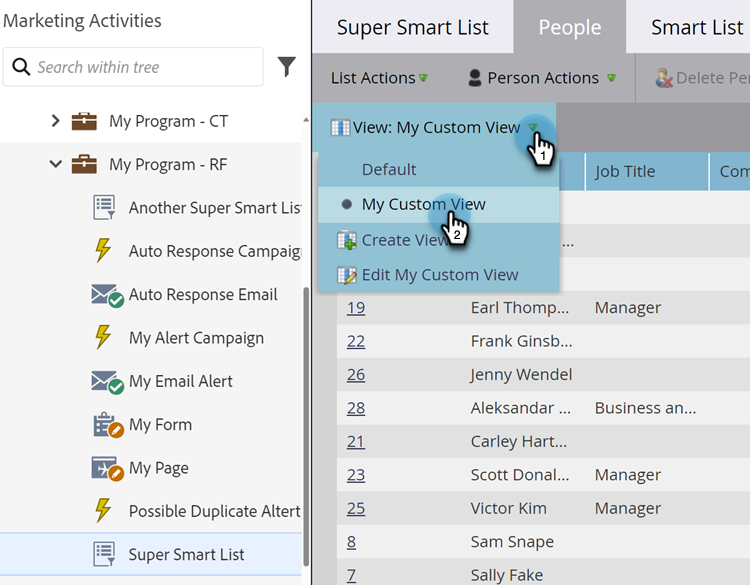
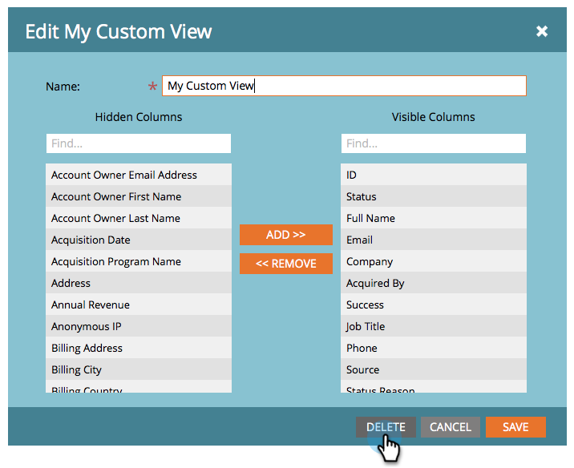

# Criar e Alterar Exibições para Listas e Smart Lists {#create-and-change-views-for-lists-and-smart-list}

Uma Smart List exibe um conjunto padrão de colunas. Você sabia que podia editar essas colunas ao conteúdo do seu coração? Veja como.

## Criar uma visualização {#create-a-view}

1. Vá para uma lista ou Smart List, clique na guia **[!UICONTROL Pessoas]** e clique em **[!UICONTROL Criar Modo de Exibição]** no menu suspenso **[!UICONTROL Modo de Exibição]**.

   

1. Nomeie a exibição e localize a coluna que deseja adicionar ou remover.

   

1. Adicione/Remova as colunas desejadas e clique em **[!UICONTROL Criar]**.

   

>[!TIP]
>
>Para pesquisar rapidamente, use a caixa **Localizar**.

## Alternar Exibições {#switch-views}

1. Clique no menu suspenso **[!UICONTROL Exibir]** e selecione o modo de exibição desejado. Alterne entre as visualizações conforme necessário.

   

>[!NOTE]
>
> Primeiro, você deve criar uma segunda exibição, além da exibição padrão, para alternar entre as exibições.

## Editar uma Exibição {#edit-a-view}

1. Verifique se o modo de exibição que você deseja editar está selecionado no menu suspenso **[!UICONTROL Modo de Exibição]**.

   

1. Clique na opção **[!UICONTROL Editar]**.

   

1. Faça as alterações desejadas e clique em **[!UICONTROL Salvar]**.

   

## Excluir uma visualização {#delete-a-view}

1. Selecione a opção **[!UICONTROL Editar]** para o modo de exibição que você deseja excluir do menu suspenso **[!UICONTROL Modo de Exibição]**.

   

1. Clique em **[!UICONTROL Excluir]**.

   

Somente você pode ver as exibições personalizadas que você cria no menu suspenso Exibir. Portanto, informe aos seus amigos que eles precisam criar as suas próprias exibições!

>[!MORELIKETHIS]
>
>* [Usar Smart Lists Internas/do Sistema](/help/marketo/product-docs/core-marketo-concepts/smart-lists-and-static-lists/using-smart-lists/use-built-in-system-smart-lists.md){target="_blank"}
>* [Criar uma lista inteligente](/help/marketo/product-docs/core-marketo-concepts/smart-lists-and-static-lists/creating-a-smart-list/create-a-smart-list.md){target="_blank"}
