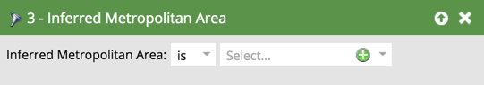

# Filtros inferidos {#inferred-filters}

Quando alguém visita o seu site, o [Munchkin](/help/marketo/product-docs/administration/additional-integrations/add-munchkin-tracking-code-to-your-website.md){target="_blank"} faz o cookie e o coloca no sistema. Pesquisamos o IP deles em um banco de dados especial e inferimos todos os tipos de informações.

>[!NOTE]
>
>Para garantir que os valores de campo inferidos permaneçam atualizados, atualizamos periodicamente o banco de dados usado para pesquisas de endereço IP. As atualizações do banco de dados podem apresentar novos valores de campo inferidos que talvez você precise adicionar às definições de filtro da Smart List.
>
>Atualizações de banco de dados podem ocorrer durante uma [versão do produto Marketo Engage](/help/marketo/release-notes/release-schedule.md){target="_blank"}. Quando ocorrer uma atualização, as [notas de versão do Marketo Engage](/help/marketo/release-notes/current.md){target="_blank"} conterão uma explicação de quaisquer alterações nos valores de campo inferidos.

Ao usar qualquer um desses filtros em uma Smart List, os resultados produzirão pessoas com essas informações inferidas.

>[!TIP]
>
>Use esses filtros em um relatório de atividades da Web. Use os territórios dos representantes de vendas e inscreva-os em um relatório diário personalizado com os visitantes do site nas últimas 24 horas. Eles vão adorar!
>
>* Página da Web visitada - Últimas 24 horas
>* O Estado inferido é [selecionar seu território]

Esses visitantes anônimos são convertidos automaticamente em pessoas quando clicam em um link de email ou preenchem um formulário. No entanto, elas mantêm todas as informações inferidas.

>[!NOTE]
>
>Saiba mais sobre [atividade anônima e clientes potenciais](/help/marketo/product-docs/core-marketo-concepts/smart-lists-and-static-lists/managing-people-in-smart-lists/understanding-anonymous-activity-and-people.md){target="_blank"}.
