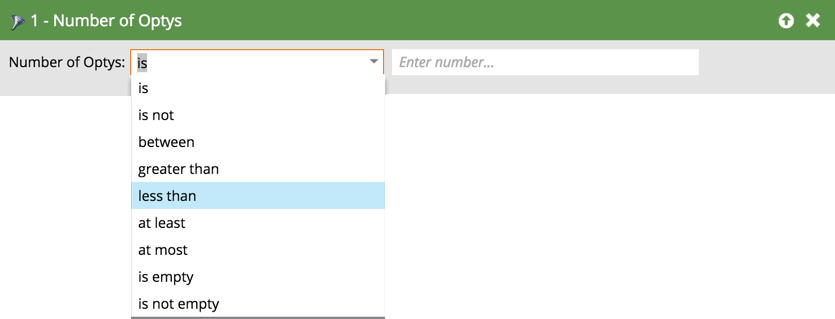

# Filtros e acionadores da oportunidade {#opportunity-filters-and-triggers}

Os filtros e acionadores de oportunidade permitem rastrear eventos de oportunidade do Salesforce. Eles são um pouco diferentes se comparados a outros filtros e acionadores.

## Filtros de oportunidade {#opportunity-filters}

Os filtros de oportunidade permitem que você se aprofunde em seus clientes potenciais do Salesforce que têm oportunidades. Você pode encontrá-las na pasta Oportunidades da Paleta ao editar uma Smart List. Eles vêm em alguns sabores.

* Número de oport
* Valor total da oport.
* Receita total esperada da oport.
* Possui oportunidade
* A oportunidade foi adicionada
* A oportunidade foi removida
* A oportunidade foi atualizada

Se estiver procurando os campos Oportunidade (personalizados ou padrão), use o **Tem oportunidade** filtro ou **A oportunidade foi`[Added/Removed/Updated]`** filtros ou acionadores.

**Número de opções, Valor total da opção, Receita esperada da opção total**

Com esses filtros, você pode encontrar leads com base no número total, na quantia ou na receita esperada de todas as suas oportunidades.

**Possui oportunidade, foi adicionado à oportunidade, foi removido da oportunidade**

Se estiver procurando clientes potenciais que têm oportunidades com base em uma combinação de critérios, use o **Tem oportunidade**, **Foi adicionado à oportunidade** ou **Foi removido da oportunidade** filtro. Eles lhe dizem:

* **Tem oportunidade**: se este cliente potencial tiver uma oportunidade correspondente no momento
* **Foi adicionado à oportunidade**: se este lead tiver sido adicionado a uma oportunidade correspondente
* **Foi removido da oportunidade**: se este cliente em potencial já foi removido de uma oportunidade correspondente

Adicionar os critérios de pesquisa como **Restrições** no filtro. As restrições incluem os campos padrão de oportunidade e personalizados:

Por exemplo, digamos que você queira encontrar leads com oportunidades abertas de pelo menos US$ 5.000. Arraste no **Tem oportunidade** filtre e use o **Está Fechado** e **Quantidade** restrições:

>[!NOTE]
>
>Ao usar vários filtros de Oportunidade, você pode obter respostas incorretas. Se você criou o exemplo acima com dois filtros Oportunidade, obterá uma lista de clientes potenciais que têm qualquer oportunidade de pelo menos US$ 5.000 e qualquer oportunidade que esteja fechada, mesmo que sejam oportunidades separadas.

**A oportunidade foi atualizada**

A variável **A oportunidade foi atualizada** O filtro procura qualquer oportunidade quando um campo de oportunidade específico foi atualizado. Selecione o campo a ser verificado com o menu suspenso Acionador de atributo, em seguida, use as restrições para restringir o conjunto de alterações.

Por exemplo, este filtro mostrará todos os clientes em potencial que tiveram sua data de fechamento alterada nos últimos 30 dias:

## Acionadores da oportunidade {#opportunity-triggers}

Os acionadores de oportunidade a seguir estão disponíveis. Eles funcionam exatamente como os filtros correspondentes (descritos anteriormente), exceto que podem acionar campanhas logo quando o evento ocorre:

* A oportunidade é atualizada
* Adicionado à oportunidade
* Removido da oportunidade

Por exemplo, você pode usar essa lista inteligente para acionar quando qualquer cliente em potencial for adicionado a qualquer oportunidade. No fluxo, você pode adicioná-los à lista de Marketing suspenso ou enviar a eles um email direcionado.

Para acionar campos personalizados de oportunidade, use o **A oportunidade foi atualizada** acione e escolha o campo no menu suspenso:

